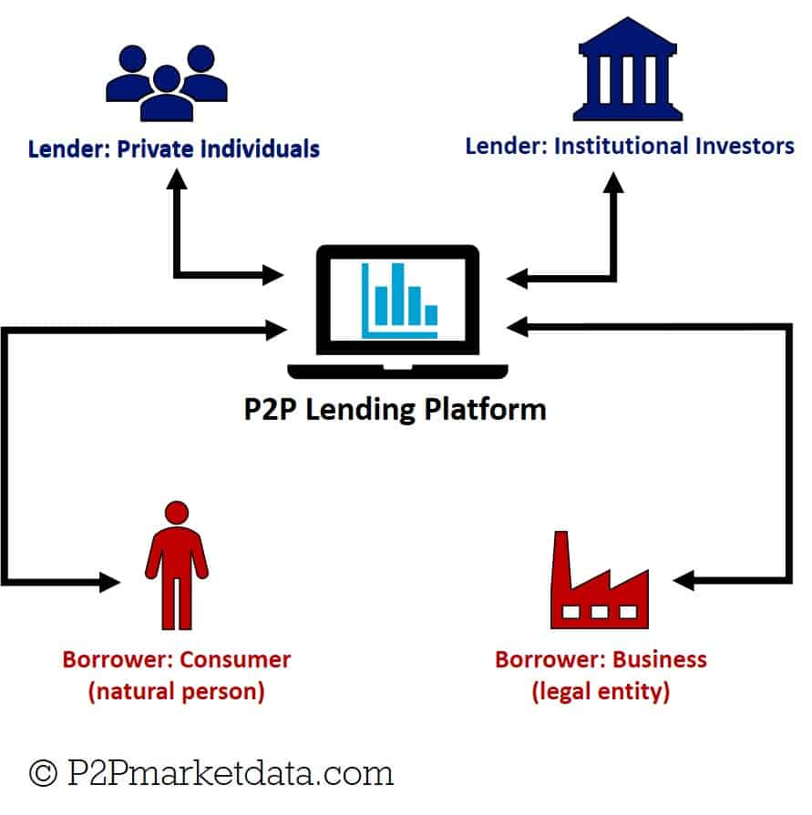

```{r setup, include=FALSE}
# We want the results to be hidden by default, though for some chunks we will override this to show the results
knitr::opts_chunk$set(warning = F, results = "hide", message = F)
```

```{r include=FALSE}
library(ezids) # We will use functions form this package to get nicer looking results
library(tidyverse) # We need this package for data manipulation, piping, and graphing
library(corrplot) # We will need this package to plot the correlation matrix
library(scales) # This package will help us when labeling the scatter plots
library(gridExtra) # For additional table and image functionality
library(expss)
library(knitr)
library(kableExtra)
library(broom)
library(purrr)
# Read in the data from the working directory
loans <- read_csv("loan_data.csv")
#loans
```

# Introduction
Peer-to-peer (P2P) lending was a phenomenon less than ten years ago, exploding in popularity by offering a break from traditional banking. Individuals flocked to these alternative credit markets to finance their small business ventures, home purchases, and to consolidate debt. Although direct P2P lending has undergone changes over recent years, it remains a viable option for borrowers and investors.

The global P2P lending market is anticipated to grow from \$84 billion in 2021 to \$706 billion by 2030, according to figures from Precedence Research.^[“Peer to Peer (P2P) Lending Market Size, Report 2022-2030.” Peer to Peer (P2P) Lending Market Size, Report 2022-2030, www.precedenceresearch.com/peer-to-peer-lending-market. Accessed 4 Nov. 2022.] This analysis takes a closer look at the mechanics of P2P lending to gain a better understanding of what considerations are factored into decisions to apply for, issue, and provide financing via P2P platforms. Analysis and statistical testing identifies credit underwriting policy and borrowers’ failure to fully pay as variables of interest that should be considered in future in-depth analyses.  

## What is P2P Lending?
P2P lending is the provision of financing without a traditional bank as the source of funds; it is, like it sounds, peers lending money to their peers. Instead of banks, online lending platforms provide a service that connects willing lenders, or investors, with individuals seeking to borrow funds. Historically, these investors have been predominantly private individuals seeking alternate forms of investments, wherein they receive the interest earned on the money they loan out.

 

Borrowers, on the other hand, are connected to feasible funding that they might not have otherwise been able to attain. Many borrowers participating in P2P lending did or would have experienced difficulties qualifying for traditional loans from banks. This perception of higher risk among the lenders can often translate into higher interest rates. P2P platforms screen borrowers and set rates and terms but it is ultimately up to the lender whether they will provide the funds. 


## Introducing LendingClub
The P2P market was dominated by LendingClub during the early rise of P2P lending, and it remains a leader in the industry. It makes money by charging borrowers an origination fee, charging investors a service fee, and selling loans in secondary markets. LendingClub’s typical annual percentage rate (APR) is between 5.99% and 35.89% while the origination fee of 1% to 6% is taken off the top of loans. Borrowers on LendingClub typically have good-to-excellent credit (700 or higher credit score) and a low debt-to-income ratio. 
 
 


# Exploratory Data Analysis or EDA
Our exploratory data analysis will closely adhere to the below 9-step checklist presented in Chapter 4 of *The Art of Data Science*.^[Peng, R. D., & Matsui, E. (2016). The Art of Data Science: A Guide for anyone who works with data. Skybrude consulting LLC.] 

1. Formulate our question
2. Read in our data
3. Check the packaging
4. Look at the top and the bottom of your data
5. Check your "n"s
6. Validate with at least one external data source
7. Make a plot
8. Try the easy solution first
9. Follow up

## Our Data
Our dataset contains over 9,500 observations of loan data from LendingClub from between 2007 and 2015. We obtained the dataset from Kaggle here: https://www.kaggle.com/datasets/urstrulyvikas/lending-club-loan-data-analysis

Our work is stored on our team GitHub here: https://github.com/jschild01/JMB_DATS_6101

Below are the variables in the dataset and their accompanying definitions as supplied by Kaggle:

```{r results = "show", echo=FALSE}
# This is copied form the Kaggle site
# We will use a kable table for simplicity
data_definitions <- data.frame(Variable = c("credit.policy", "purpose", "int.rate", "installment", "log.annual.inc", "dti", "fico", "days.with.cr.line", "revol.bal", "revol.util", "inq.last.6mths", "delinq.2yrs", "pub.rec", "not.fully.paid"),
                          Definition = c("1 if the customer meets the credit underwriting criteria of LendingClub.com, and 0 otherwise.",
                                         "The purpose of the loan (takes values creditcard, debtconsolidation, educational, majorpurchase, smallbusiness, and all_other).",
                                         "The interest rate of the loan, as a proportion (a rate of 11% would be stored as 0.11). Borrowers judged by LendingClub.com to be more risky are assigned higher interest rates.",
                                         "The monthly installments owed by the borrower if the loan is funded.",
                                         "The natural log of the self-reported annual income of the borrower.",
                                         "The debt-to-income ratio of the borrower (amount of debt divided by annual income).",
                                         "The FICO credit score of the borrower.",
                                         "The number of days the borrower has had a credit line.",
                                         "The borrower's revolving balance (amount unpaid at the end of the credit card billing cycle).",
                                         "The borrower's revolving line utilization rate (the amount of the credit line used relative to total credit available).",
                                         "The borrower's number of inquiries by creditors in the last 6 months.",
                                         "The number of times the borrower had been 30+ days past due on a payment in the past 2 years.",
                                         "The borrower's number of derogatory public records (bankruptcy filings, tax liens, or judgments).",
                                         "Whether the borrower will be fully paid or not."))

kable(data_definitions) %>%
  kable_styling(bootstrap_options = c("striped", "condensed"))
```


## SMART Question
Our analysis will explore things such as income-to-debt ratios, credit score, interest rates, and delinquencies among direct P2P borrowers in an attempt to understand the risks and opportunities associated with P2P lending. Specifically, we intend to examine the impact that these variables have on who received loans and who defaulted on their loans between 2007 and 2015. 

We will seek to answer few of the following questions:  

1.	What variable or variables, if any, have an impact on if the person meets the credit underwriting criteria? How strong is that impact?  
2.	What variable or variables, if any, have an impact on if the person fully repays the loan? How strong is that impact?  
3.	Do borrowers who meet the credit underwriting criteria have a lower chance of not fully repaying the loan? If so, how big of a difference is it, and is it statistically significant?

## First Look
For our analysis we will use the ezids, tidyverse, corrplot, scales, gridExtra, expss, knitr, kableExtra, broom, and purr libraries. Our dataset contains `r nrow(loans)` rows of data with `r ncol(loans)` columns and is structured like this:

```{r results = "show", echo=FALSE, comment=""}
# There is unfortunately no ezids function to see the result in a nice looking table, so we will use the standard function.
# str(loans)

info(loans) %>%
  select(Name, Class, Length, Frequency) %>%
  kable(align="l") %>%
  kable_styling(bootstrap_options = c("striped", "condensed"))
```

By examining the structure of our data, we can see that there is only one character variable which like a factor, and some of the numeric variables look like logicals.

Here we can see the top and bottom rows of our dataset to get a better feel for the data. This will help us better understand the values in our dataset and how to most effectively deal with them.

```{r results = "show", echo=FALSE}
# We use the xkabledplyhead() function form the ezids package to see the result in a nice looking table.
xkabledplyhead(loans)
```

```{r results = "show", echo=FALSE}
# We use the xkabledplytail() function form the ezids package to see the result in a nice looking table.
xkabledplytail(loans)
```

The top and bottom rows of our dataset indicate the data is structured in an acceptable way and that our variables match up with the values for each column. 

According to the Kaggle site where we got this dataset from, there are 9,578 rows and 14 columns, which matches what we have. The site also shows that there is no missing data. We can verify that by adding the total number of missing cells in the dataset, which is `r sum(is.na(loans))`, and check the total number of null cells, which is `r sum(is.null(loans))`. We can also check if the observations are unique, and we see that all `r nrow(unique(loans))` rows are unique.

This means the data looks good so far and we can now move on to the descriptive statistics part of our EDA.

## Descriptive Statistics

Below are some descriptive statistics of the variables to help us better understand the data.
```{r results = "show", echo=FALSE}
# We use the xkablesummary() function from the ezids package to see the result in a nice looking table.
xkablesummary(loans)
```

We have an idea of what to expect for a few variables, such as interest rate and credit score, so we were able to test the dataset against some of our expectations to gauge its reliability. By inspecting the summary table, we can see that interest rates for the data are between `r paste0(min(loans$int.rate)*100,"%")` and `r paste0(max(loans$int.rate)*100,"%")` and credit scores range from `r min(loans$fico)` to `r max(loans$fico)`. Although interest rates might seem to reach excessively high rates or credit scores too meager, the P2P market tended to consist of more risky loans. This aligns with our expectation and reinforces our confidence in the dataset. 

The range of the utilization, or the percent of credit being used, is between `r paste0(min(loans$revol.util), "%")` and `r paste0(max(loans$revol.util), "%")`. Someone utilizing more than 100% of the credit available to them initially seemed erroneous; however, this can occur from technical error, creditors and collectors reporting at different date/times, borrowers opening and closing credit lines, or possibly when borrowers appear as authorized users of others’ credit lines. Regardless of the reason, only `r sum(loans$revol.util > 100)` loans within our dataset appear to exceed the standard maximum of 100% so we do not expect this to have a significant effect on our analysis, thereby allowing us to continue with our EDA.

We want to see a measure of dispersion/variation, namely standard deviation, for the numeric variables. The values are as follows:

```{r, results = "show", echo=FALSE}
# Alternate table for standard deviations
standard_deviations <- tibble(Variable = colnames(loans),
                              `Standard Deviation` = sapply(loans, sd)) %>%
  filter(Variable != "purpose") %>%
  mutate(`Standard Deviation` = round(`Standard Deviation`, 2))

kable(standard_deviations) %>%
  kable_styling(bootstrap_options = c("striped", "condensed"))
```

Here, we have used standard deviation as a measure of dispersion to understand the spread of each of the variables. While variables like `credit.policy` and `not.fully.paid` can only take one of 2 values, namely 0 and 1, variables like `revol.bal`,`days.with.cr.line` and `installment` have the highest standard deviations in that order.

We are satisfied with the data so far, so the next step is to begin visualizing it.


## Initial Plots

Below is a histogram for each non-logical numeric variable to help us understand how the data is distributed:
```{r fig.width=8, echo=FALSE}
# By gathering the variables we want to see into a long format with the gather() function, we can then create a histogram
# for each variable using the facet_wrap() function in ggplot2.
loans %>%
  select(int.rate, installment, log.annual.inc, dti, fico, days.with.cr.line, revol.bal, revol.util,
           inq.last.6mths, delinq.2yrs, pub.rec) %>%
  gather(variable, value) %>%
  ggplot(aes(x = value)) +
  geom_histogram(fill = "steelblue", color = "black") +
  facet_wrap(~ variable, scales = "free") + # Free scales so the graphs are readable
  labs(title = "Histograms of Numeric Variables", x = "Value", y = "Count") +
  theme_minimal()
```

One of the primary things we are looking for, normality, we can see with the `log.annual.inc` variable. Some other variables look at least somewhat normal, such as `days.with.cr.line`, `fico`, `installment`, and `int.rate`. We will make Q-Q plots later to get a better sense of the normality of these variables.

The `revol.util` variable is fairly flat, and the `dti` a little more rounded, but not normal looking. There are four variables where we clearly have outlier issues: `delinq.2yrs`, `inq.last.6.mths`, `pub.rec`, and `revol.bal`. For those we can see one or a small number of large bars on the left, and then a fairly flat graph around zero after that.

To help get a better look at the outliers, below are boxplots for the same variables:
```{r fig.width=8, echo=FALSE}
# By gathering the variables we want to see into a long format with the gather() function, we can then create a boxplot
# for each variable using the facet_wrap() function in ggplot2.
loans %>%
  select(int.rate, installment, log.annual.inc, dti, fico, days.with.cr.line, revol.bal, revol.util,
           inq.last.6mths, delinq.2yrs, pub.rec) %>%
  gather(variable, value) %>%
  ggplot(aes(x = value)) +
  geom_boxplot(fill = "steelblue", color = "black",
               outlier.size = 2, outlier.alpha = 0.2) + # Translucent and larger outliers to help with overplotting
  facet_wrap(~ variable, scales = "free") + # Free scales so the graphs are readable
  labs(title = "Boxplots of Numeric Variables", x = "Value") +
  theme_minimal() +
  theme(axis.text.y = element_blank(), axis.ticks.y = element_blank())
```

Setting the outlier.alpha to 0.2 to compensate for overplotting, we can now get a better understanding of the four variables with outlier issues. For `delinq.2yrs` and `public.rec`, nearly all of the observations are 0, with a small number of outliers at integer values above zero. It looks like these two variables will not be very useful to us.

The `inq.last.6mths` does have some range, with most observations one of 0, 1, or 2. We can consider taking out the outliers later on, and hopefully this variable will prove useful.

The `revol.bal` variable actually has a good range, but the outliers are so far out that it is difficult to see. For this variable we’ll want to consider removing outliers and possibly transforming the data by taking the natural log of it, like was already done with the `annual.inc` variable.

We can take a look at the factor and logical variables with bar charts:
```{r fig.width=8, echo=FALSE}
# By gathering the variables we want to see into a long format with the gather() function, we can then create a bar graph
# for each variable using the facet_wrap() function in ggplot2.
loans %>%
  select(credit.policy, purpose, not.fully.paid) %>%
  gather(variable, value) %>%
  ggplot(aes(x = value)) +
  geom_bar(fill = "steelblue", color = "black") +
  facet_wrap(~ variable, scales = "free") + # Free scales so the graphs are readable
  coord_flip() +
  labs(title = "Bar Charts of Non-Numeric Variables", x = "Value", y = "Count") +
  theme_minimal() +
  theme()
```

From this we can see that the `purpose` variable would be a good candidate to perform ANOVA tests on. We can see that for each value of these variables there are at least a few hundred observations, so we should have a large enough sample size in further analysis and statistical tests. At this point we can comfortable convert `credit.policy` and `not.fully.paid` to logicals, and `purpose` to a factor.

```{r include=FALSE}
# These variables may act differently from here on out
loans$credit.policy <- as.logical(loans$credit.policy)
loans$not.fully.paid <- as.logical(loans$not.fully.paid)

loans$purpose <- as.factor(loans$purpose)
```

Now we can further explore the data to see how the numeric variables differ based on the on the `credit.policy`, `not.fully.paid`, and `purpose` variables. Let's make some boxplots to visualize this.


## Additional Boxplots

Here we look at the numeric variables for individual sub-categories of the logical and categorical variables. This helps us comprehensively understand how the numerical variables are distributed with respect to each of the logical and categorical values.
```{r fig.width=8, echo=FALSE}
# By gathering the variables we want to see into a long format with the gather() function, we can then create a boxplot
# for each variable using the facet_wrap() function in ggplot2. We can see this for each credit policy value by excluding
# it in the gather() function.
loans %>%
  select(int.rate, installment, log.annual.inc, dti, fico, days.with.cr.line, revol.bal, revol.util,
           inq.last.6mths, delinq.2yrs, pub.rec, credit.policy) %>%
  gather(variable, value, -credit.policy) %>%
  ggplot(aes(x = value, y = as.logical(credit.policy), fill = as.logical(credit.policy))) +
  geom_boxplot(outlier.size = 2, outlier.alpha = 0.2) +  # Translucent and larger outliers to help with overplotting
  guides(fill = guide_legend(reverse = TRUE)) + # So the legend order matches the order in the graphs
  facet_wrap(~ variable, scales = "free_x") + # Free x scale so the graphs are readable
  labs(title = "Boxplots of Numeric Variables", subtitle = "Comparing `credit.policy` Values",
       x = "Value", y = "Count", fill = "Credit Policy") +
  theme_minimal()
```

Looking at this there are a few numeric variables that look fairly different depending on `credit.policy`: `fico`, `inq.last.6.mths`, and `int.rate`.

```{r fig.width=8, echo=FALSE}
# By gathering the variables we want to see into a long format with the gather() function, we can then create a boxplot
# for each variable using the facet_wrap() function in ggplot2. We can see this for each not fully paid value by excluding
# it in the gather() function.
loans %>%
  select(int.rate, installment, log.annual.inc, dti, fico, days.with.cr.line, revol.bal, revol.util,
           inq.last.6mths, delinq.2yrs, pub.rec, not.fully.paid) %>%
  gather(variable, value, -not.fully.paid) %>%
  ggplot(aes(x = value, y = as.logical(not.fully.paid), fill = as.logical(not.fully.paid))) +
  geom_boxplot(outlier.size = 2, outlier.alpha = 0.2) +  # Translucent and larger outliers to help with overplotting
  guides(fill = guide_legend(reverse = TRUE)) + # So the legend order matches the order in the graphs
  facet_wrap(~ variable, scales = "free_x") + # Free x scale so the graphs are readable
  labs(title = "Boxplots of Numeric Variables", subtitle = "Comparing `not.fully.paid` Values",
       x = "Value", y = "Count", fill = "Not Fully Paid") +
  theme_minimal()
```

Looking at this there aren’t any variables that visually stand out to a significant degree.

```{r fig.width=8, echo=FALSE}
# By gathering the variables we want to see into a long format with the gather() function, we can then create a boxplot
# for each variable using the facet_wrap() function in ggplot2. We can see this for each purpose value by excluding
# it in the gather() function.
loans %>%
  select(int.rate, installment, log.annual.inc, dti, fico, days.with.cr.line, revol.bal, revol.util,
           inq.last.6mths, delinq.2yrs, pub.rec, purpose) %>%
  gather(variable, value, -purpose) %>%
  ggplot(aes(x = value, y = purpose, fill = purpose)) +
  geom_boxplot(outlier.size = 2, outlier.alpha = 0.2) +
  guides(fill = guide_legend(reverse = TRUE)) + # So the legend order matches the order in the graphs
  facet_wrap(~ variable, scales = "free_x") + # Free x scale so the graphs are readable
  labs(title = "Boxplots of Numeric Variables", subtitle = "Comparing `purpose` Values",
       x = "Value", y = "Count", fill = "Purpose") +
  theme_minimal()
```

From this we can see some of the `purpose` categories stand out for certain variables. The `debt_consolidation` and `credit_card` purposes stand out for `dti` and `revol.util`, while `small_business` stands out for `installment` and `int.rate`. We will perform one-way ANOVA tests later to confirm what we can see here.

```{r echo=FALSE}
# Covariance Matrix
loans_covarience_matrix <- loans %>%
  select(-purpose) %>%
  cov()
# loans_covarience_matrix
# png("loans_covarience_matrix.png", height=2000, width=2000)
# p<-tableGrob(loans_covarience_matrix)
# grid.arrange(p)
# dev.off()
```


## Correlation Plot

The correlation plot below gives an overview of how each of the variables in the dataset may relate to each other. This plot includes every variable except the `purpose` variable.
```{r fig.width=7, fig.height=7, echo=FALSE}
# For our correlation matrix we want to include everything but the purpose variable
loans_correlation_matrix <- loans %>%
  select(-purpose) %>%
  cor()
# loans_correlation_matrix
# png("loans_correlation_matrix.png", height=2000, width=2000)
# p<-tableGrob(loans_correlation_matrix)
# grid.arrange(p)
# dev.off()

# The mixed correlation plot makes a nice visualization
corrplot.mixed(loans_correlation_matrix, tl.pos = "lt")
```

This allows us to quantify some of the stand-outs in the additional boxplots such as `int.rate`, `fico`, and `inq.last.6mths` compared to `credit.policy`. There are also four other correlations that are either greater than 0.4 or less than -0.4 that we want to explore further.


## Scatter Plots

Based on the four variable correlations we have not looked at yet that are greater than 0.4 or less than -0.4, these scatter plots allow us to get a better understanding of those correlations.
```{r echo=FALSE}
loans %>%
  ggplot(aes(x = fico, y = int.rate)) +
  geom_point(color = "steelblue", alpha = 0.2) +
  labs(title = "Interest Rate vs FICO Score",
       x = "FICO Score", y = "Interest Rate") +
  scale_x_continuous(limits = c(600, NA), expand = expansion(mult = c(0, .05))) +
  scale_y_continuous(labels = label_percent(), limits = c(.05, NA), expand = expansion(mult = c(0, .05))) +
  theme_minimal()
```

Using a point alpha to 0.2 to compensate for overplotting we can see a clear trend of interest rates falling as the borrower’s FICO score goes up, which matches our expectations. All of the FICO scores end in 2 or 7, which is why the results fall into vertical lines.

```{r echo=FALSE}
loans %>%
  ggplot(aes(x = int.rate, y = revol.util)) +
  geom_point(color = "steelblue", alpha = 0.2) +
  labs(title = "Revolving Line Utilization Rate vs Interest Rate",
       x = "Interest Rate", y = "Revolving Line Utilization Rate") +
  scale_x_continuous(labels = label_percent(), limits = c(.05, NA), expand = expansion(mult = c(0, .05))) +
  scale_y_continuous(labels = label_percent(scale = 1)) +
  theme_minimal()
```

Here we can see that as the borrower’s interest rate climbs, so does the revolving line utilization rate. This makes sense because we would expect a higher interest rate to be associated with a more risky loan. If the loan is riskier the borrower probably has more difficulty getting credit, and therefore would make use of a higher percentage of the credit they do have available.

```{r echo=FALSE}
loans %>%
  ggplot(aes(x = log.annual.inc, y = installment)) +
  geom_point(color = "steelblue", alpha = 0.2) +
  labs(title = "Installment vs Log of Annual Income",
       x = "Log of Annual Income", y = "Installment") +
  theme_minimal()
```

As the natural log of the borrower’s annual income increases, we see that the installment of their loan does as well. This also matches our expectations, as those who make more money would likely be able to make higher payments.

```{r echo=FALSE}
loans %>%
  ggplot(aes(x = fico, y = revol.util)) +
  geom_point(color = "steelblue", alpha = 0.2) +
  labs(title = "Revolving Line Utilization Rate vs FICO Score",
       x = "FICO Score", y = "Revolving Line Utilization Rate") +
  scale_x_continuous(limits = c(600, NA), expand = expansion(mult = c(0, .05))) +
  scale_y_continuous(labels = label_percent(scale = 1)) +
  theme_minimal()
```

We see that as the borrower’s FICO score goes up, their revolving line utilization rate decreases, related to the explanations from the above scatter plots. In the end, this also matches our expectations.


## Last EDA Steps

Before moving into more advanced statistical tests we want to take an initial look at loans that meet the credit underwriting criteria vs the borrower not fully paying. Based on the `credit.policy` and `not.fully.paid` variables, we can calculate the percentage of borrowers who did not fully pay based on if they met the credit underwriting criteria.

```{r results = "show", echo=FALSE}
# We will convert the average to an easier to read percentage by multiplying by 100, rounding, and adding a "%" at the end.
loans %>%
  group_by(credit.policy) %>%
  summarize(percent_not_fully_paid = paste0(round(100*mean(not.fully.paid), 1), "%"))  %>%
  ungroup() %>%
  rename(`Meets Credit Policy` = credit.policy, `Percent Not Fully Paid` = percent_not_fully_paid) %>%
  kable(align = "c") %>%
  kable_styling(bootstrap_options = c("striped", "condensed"))
```
  
  
From this we can see that about 13.2% of borrowers who met the credit underwriting criteria did not fully pay, while for the borrowers who did not meet the credit underwriting criteria about 27.8% did not fully pay. 

This indicates borrowers who did not meet the credit underwriting criteria were about twice as likely to default on their loans than those who did meet the criteria. For comparison, default rates on loans from commercial banks for the same period as our dataset averaged 4.48%, with a maximum default rate of 7.49% default rate towards the end of 2009, according to the St. Louis Federal Reserve Bank.^[“Delinquency Rate on All Loans, All Commercial Banks.” Delinquency Rate on All Loans, All Commercial Banks (DRALACBN) | FRED | St. Louis Fed, 22 Aug. 2022, fred.stlouisfed.org/series/DRALACBN.]

We can confirm that these loans were definitely riskier, especially so if they did not meet the credit underwriting criteria. Based on this a potential lender would be wise to give serious consideration to whether or not the potential borrower meets the credit underwriting policy.


# Statistical Tests
We conducted and performed Q-Q plots, ANOVAs, and chi-squared tests to examine the variables in our dataset and gain a better understanding of how they interact with each other. 

Since our dataset is a subset of all loans facilitated by LendingClub between the years 2007 and 2015, we can treat it as a sample and conduct t-tests which confirm that the means of all the variables of the sample coincide with the means of our population. However, we cannot perform z-tests on this data because we cannot make an estimate about the standard deviation of the population (all loans facilitated by LendingClub).^[End to end case study (classification): Lending Club Data. (n.d.). Retrieved November 3, 2022, from https://towardsdatascience.com/end-to-end-case-study-classification-lending-club-data-489f8a1b100a] ^[Yiu, T. (2019, June 19). Turning Lending Club’s Worst Loans into Investment Gold. Medium. https://towardsdatascience.com/turning-lending-clubs-worst-loans-into-investment-gold-475ec97f58ee] ^[Lending Club Review: How it Works, Requirements and Alternatives. (n.d.). Debt.org. https://www.debt.org/credit/loans/personal/lending-club-review/] ^[Project 1: Analysis of Lending Club’s data. (n.d.). Data Science Blog. Retrieved November 3, 2022, from https://nycdatascience.com/blog/student-works/project-1-analysis-of-lending-clubs-data/] ^[Ph.D, M. K. (2019, April 9). LendingClub: bias in data? Machine learning and investment strategy. Retrieved November 3, 2022, from Medium website: https://michel-kana.medium.com/lendingclub-bias-in-data-machine-learning-and-investment-strategy-3a3bd1c65f0]


```{r echo=FALSE}
ttest95rate = t.test(x=loans$int.rate) # default conf.level = 0.95
ttest99rate = t.test(x=loans$int.rate, conf.level=0.99 )
ttest50rate = t.test(x=loans$int.rate, conf.level=0.50 )

tab <- map_df(list(ttest95rate, ttest99rate, ttest50rate),tidy)
tab
# png("t1.png", height=100, width=700)
# p<-tableGrob(tab)
# grid.arrange(p)
# dev.off()
```

```{r echo=FALSE}
ttest95installment = t.test(x=loans$installment) # default conf.level = 0.95
ttest99installment = t.test(x=loans$installment, conf.level=0.99 )
ttest50installment = t.test(x=loans$installment, conf.level=0.50 )

tab <- map_df(list(ttest95installment,ttest99installment,ttest50installment), tidy)
tab
# png("t2.png", height=100, width=700)
# p<-tableGrob(tab)
# grid.arrange(p)
# dev.off()
```

```{r echo=FALSE}
ttest95annual = t.test(x=loans$log.annual.inc) # default conf.level = 0.95
ttest99annual = t.test(x=loans$log.annual.inc, conf.level=0.99 )
ttest50annual = t.test(x=loans$log.annual.inc, conf.level=0.50 )

tab <- map_df(list(ttest95annual,ttest99annual,ttest50annual), tidy)
tab
# png("t3.png", height=100, width=700)
# p<-tableGrob(tab)
# grid.arrange(p)
# dev.off()
```

```{r echo=FALSE}
ttest95fico = t.test(x=loans$fico) # default conf.level = 0.95
ttest99fico = t.test(x=loans$fico, conf.level=0.99 )
ttest50fico = t.test(x=loans$fico, conf.level=0.50 )

tab <- map_df(list(ttest95fico,ttest99fico,ttest50fico), tidy)
tab
# png("t4.png", height=100, width=700)
# p<-tableGrob(tab)
# grid.arrange(p)
# dev.off()
```

```{r echo=FALSE}
ttest95dti = t.test(x=loans$dti) # default conf.level = 0.95
ttest99dti = t.test(x=loans$dti, conf.level=0.99 )
ttest50dti = t.test(x=loans$dti, conf.level=0.50 )

tab <- map_df(list(ttest95dti,ttest99dti,ttest50dti), tidy)
tab
# png("t5.png", height=100, width=700)
# p<-tableGrob(tab)
# grid.arrange(p)
# dev.off()
```

```{r echo=FALSE}
ttest95days.with.cr.line = t.test(x=loans$days.with.cr.line) # default conf.level = 0.95
ttest99days.with.cr.line = t.test(x=loans$days.with.cr.line, conf.level=0.99 )
ttest50days.with.cr.line = t.test(x=loans$days.with.cr.line, conf.level=0.50 )


tab <- map_df(list(ttest95days.with.cr.line,ttest99days.with.cr.line,ttest50days.with.cr.line), tidy)
tab
# png("t6.png", height=100, width=700)
# p<-tableGrob(tab)
# grid.arrange(p)
# dev.off()
```

```{r echo=FALSE}
ttest95revol.bal = t.test(x=loans$revol.bal) # default conf.level = 0.95
ttest99revol.bal = t.test(x=loans$revol.bal, conf.level=0.99 )
ttest50revol.bal = t.test(x=loans$revol.bal, conf.level=0.50 )

tab <- map_df(list(ttest95revol.bal,ttest99revol.bal,ttest50revol.bal), tidy)
tab
# png("t7.png", height=100, width=700)
# p<-tableGrob(tab)
# grid.arrange(p)
# dev.off()
```

```{r echo=FALSE}
ttest95revol.util = t.test(x=loans$revol.util) # default conf.level = 0.95
ttest99revol.util = t.test(x=loans$revol.util, conf.level=0.99 )
ttest50revol.util = t.test(x=loans$revol.util, conf.level=0.50 )

tab <- map_df(list(ttest95revol.util,ttest99revol.util,ttest50revol.util), tidy)
tab
# png("t8.png", height=100, width=700)
# p<-tableGrob(tab)
# grid.arrange(p)
# dev.off()
```

```{r echo=FALSE}
ttest95inq.last.6mths = t.test(x=loans$inq.last.6mths) # default conf.level = 0.95
ttest99inq.last.6mths = t.test(x=loans$inq.last.6mths, conf.level=0.99 )
ttest50inq.last.6mths = t.test(x=loans$inq.last.6mths, conf.level=0.50 )

tab <- map_df(list(ttest95inq.last.6mths,ttest99inq.last.6mths,ttest50inq.last.6mths), tidy)
tab
# png("t9.png", height=100, width=700)
# p<-tableGrob(tab)
# grid.arrange(p)
# dev.off()
```

```{r echo=FALSE}
ttest95delinq.2yrs = t.test(x=loans$delinq.2yrs) # default conf.level = 0.95
ttest99delinq.2yrs = t.test(x=loans$delinq.2yrs, conf.level=0.99 )
ttest50delinq.2yrs = t.test(x=loans$delinq.2yrs, conf.level=0.50 )

tab <- map_df(list(ttest95delinq.2yrs,ttest99delinq.2yrs,ttest50delinq.2yrs), tidy)
tab
# png("t10.png", height=100, width=700)
# p<-tableGrob(tab)
# grid.arrange(p)
# dev.off()
```

```{r echo=FALSE}
ttest95pub.rec = t.test(x=loans$pub.rec) # default conf.level = 0.95
ttest99pub.rec = t.test(x=loans$pub.rec, conf.level=0.99 )
ttest50pub.rec = t.test(x=loans$pub.rec, conf.level=0.50 )

tab <- map_df(list(ttest95pub.rec,ttest99pub.rec,ttest50pub.rec), tidy)
tab
# png("t11.png", height=100, width=700)
# p<-tableGrob(tab)
# grid.arrange(p)
# dev.off()
```

## Q-Q Plots for Normality Test:

We want to create a Q-Q plot for each numeric variable so we can perform a normality test for each. This reinforces what we was in the histograms during our EDA.

```{r echo=FALSE}
# By gathering the variables we want to see into a long format with the gather() function, we can then create a Q-Q plot
# for each variable using the facet_wrap() function in ggplot2.
loans %>%
  select(int.rate, installment, log.annual.inc, dti, fico, days.with.cr.line, revol.bal, revol.util,
           inq.last.6mths, delinq.2yrs, pub.rec) %>%
  gather(variable, value) %>%
  ggplot(aes(sample = value)) +
  geom_qq(color = "steelblue") +
  geom_qq_line() +
  facet_wrap(~ variable, scales = "free") + # Free scales so the graphs are readable
  labs(title = "Q-Q Plots of Numeric Variables", x = "Theoretical", y = "Sample") +
  theme_minimal()
```

From the plots we see can see that the variables `int.rate`,`log.annual.inc`, and `fico` are the three most normalized variables.


## ANOVA Tests
ANOVA indicates that there is a significant difference in the means of all of our variables for the different categories of `purpose`, except for one.  Subsequent Tukey tests confirm these differences and validate our ANOVA tests. The ANOVA test for the one exception — delinquencies in the past two years — indicates there is no significant difference in its mean for the different categories of `purpose`. Similarly, subsequent Tukey tests confirm this lack of a difference and validate the ANOVA test.

```{r echo=FALSE}
aovrate=aov(int.rate ~ purpose, data = loans)
aovratesummary=summary(aovrate)
aovratesummary
aovrateturkey=TukeyHSD(aovrate)
aovrateturkey
```

```{r echo=FALSE}
aovinstallment=aov(installment ~ purpose, data = loans)
aovinstallmentsummary=summary(aovinstallment)
aovinstallmentsummary
aovinstallmentturkey=TukeyHSD(aovinstallment)
aovinstallmentturkey
```

```{r echo=FALSE}
aovannual=aov(log.annual.inc ~ purpose, data = loans)
aovannualsummary=summary(aovannual)
aovannualsummary
aovannualturkey=TukeyHSD(aovannual)
aovannualturkey
```

```{r echo=FALSE}
aovdti=aov(dti ~ purpose, data = loans)
aovdtisummary=summary(aovdti)
aovdtisummary
aovdtiturkey=TukeyHSD(aovdti)
aovdtiturkey
```

```{r echo=FALSE}
aovfico=aov(fico ~ purpose, data = loans)
aovficosummary=summary(aovfico)
aovficosummary
aovficoturkey=TukeyHSD(aovfico)
aovficoturkey
```

```{r echo=FALSE}
aovcrline=aov(days.with.cr.line ~ purpose, data = loans)
aovcrlinesummary=summary(aovcrline)
aovcrlinesummary
aovcrlineturkey=TukeyHSD(aovcrline)
aovcrlineturkey
```

```{r echo=FALSE}
aovrbal=aov(revol.bal ~ purpose, data = loans)
aovrbalsummary=summary(aovrbal)
aovrbalsummary
aovrbalturkey=TukeyHSD(aovrbal)
aovrbalturkey
```

```{r echo=FALSE}
aovrutil=aov(revol.util ~ purpose, data = loans)
aovrutilsummary=summary(aovrutil)
aovrutilsummary
aovrutilturkey=TukeyHSD(aovrutil)
aovrutilturkey
```

```{r echo=FALSE}
aov6mts=aov(inq.last.6mths ~ purpose, data = loans)
aov6mtssummary=summary(aov6mts)
aov6mtssummary
aov6mtsturkey=TukeyHSD(aov6mts)
aov6mtsturkey
```

```{r echo=FALSE}
aov2yrs=aov(delinq.2yrs ~ purpose, data = loans)
aov2yrssummary=summary(aov2yrs)
aov2yrssummary
aov2yrsturkey=TukeyHSD(aov2yrs)
aov2yrsturkey
```

```{r echo=FALSE}
aovpubrec=aov(pub.rec ~ purpose, data = loans)
aovpubrecsummary=summary(aovpubrec)
aovpubrecsummary
aovpubrecturkey=TukeyHSD(aovpubrec)
aovpubrecturkey
```


## Chi-Squared Tests
Chi-square tests confirm that three variables had an association between each other. The p-values between `purpose` and `credit.policy`, `purpose` and `not.fully.paid`, and `credit.policy` and `not.fully.paid`, are less than our chosen significance level of α = 0.05, and therefore we can confidently reject the null hypotheses for these. This indicates there are consequential relationships between these variables.

Chi-square test for `purpose` vs `credit.policy`:
```{r echo=FALSE}
test = chisq.test(table(loans$purpose,loans$credit.policy))
test
test$observed
test$expected
test$residuals

corrplot(test$residuals, is.cor = FALSE)
```

Chi-square test for `purpose` vs `not.fully.paid`:
```{r echo=FALSE}
test = chisq.test(table(loans$purpose,loans$not.fully.paid))
test

test$observed
test$expected
test$residuals

corrplot(test$residuals, is.cor = FALSE)
```

Chi-square test for `credit.policy` vs `not.fully.paid`:
```{r echo=FALSE}
test = chisq.test(table(loans$credit.policy,loans$not.fully.paid))
test

test$observed
test$expected
test$residuals

corrplot(test$residuals, is.cor = FALSE)
```


# Conclusion

From our analysis of the dataset we find that:

1. The credit underwriting criteria of LendingClub is proven to be effective as borrowers who do not meet the credit underwriting criteria are more than twice as likely to default in comparison to borrowers who do meet the criteria.  
2. There are some proven relationships between `credit.policy` and other numeric variables such as `int.rate`, `fico`, and `inq.last.6mths`.  
3. So far there are no clearly established relationships between `not.fully.paid` and other numeric variables (except for `credit.policy`).  
4. There are statistically significant relationships between the categorical and logical variables `purpose`, `credit.policy`, and `not.fully.paid`.  
5. For all numeric variables except for `delinq.2yrs`, their mean significantly varies for different categories of`purpose`.


## Vulnerabilities to Our Analysis

Private individuals historically made up the bulk of lenders in P2P markets. However, high interest rates and the prospects of risky borrowers undermined P2P lending as a legitimate financial industry. Combined with the urge for more growth by intermediaries like LendingClub, these concerns began to prompt higher lending standards and discussions about more regulation. By 2017, larger institutions and banks began to take over private individuals as the primary sources of lending in P2P markets. We assume this shift in P2P lenders altered the makeup of who receives what.

Furthermore, this dataset covers years of very different economic environments. For example, it contains data points from prior to, during, and after the 2008 financial crisis. Since we do not know the exact year of the individual loans we cannot take the time period into consideration, nor can we do time-series analysis to see how it affects the variables.

# Follow-Up: Revolving Balance
While the annual income data was given to us as a natural log, the revolving balance was given to us unmodified. We discovered that taking the log of of the `revol.bal` variable gives a better result with a more normal distribution rendering the variable more usable. However, some loans have a `revol.bal` value of 0  which returns -Inf when the natural log is taken. We will need to revisit this in the future. For now, we want to demonstrate the results of taking the log of `revol.bal`and how it increases the readability of the data.

```{r echo=FALSE, fig.width=4, fig.height=4}
loans %>%
  ggplot(aes(x = revol.bal)) +
  geom_histogram(fill = "steelblue", color = "black") +
  labs(title = "Histogram of Revolving Balance", x = "Revolving Balance", y = "Count") +
  theme_minimal()

loans %>%
  ggplot(aes(sample = revol.bal)) +
  geom_qq(color = "steelblue") +
  geom_qq_line() +
  labs(title = "Q-Q Plot of Revolving Balance", x = "Theoretical", y = "Sample") +
  theme_minimal()

loans$revol.bal=log(loans$revol.bal)

loans %>%
  ggplot(aes(x = revol.bal)) +
  geom_histogram(fill = "steelblue", color = "black") +
  labs(title = "Histogram of Natural Log of Revolving Balance", x = "Revolving Balance", y = "Count") +
  theme_minimal()

loans %>%
  ggplot(aes(sample = revol.bal)) +
  geom_qq(color = "steelblue") +
  geom_qq_line() +
  labs(title = "Q-Q Plot of Natural Log of Revolving Balance", x = "Theoretical", y = "Sample") +
  theme_minimal()
```
