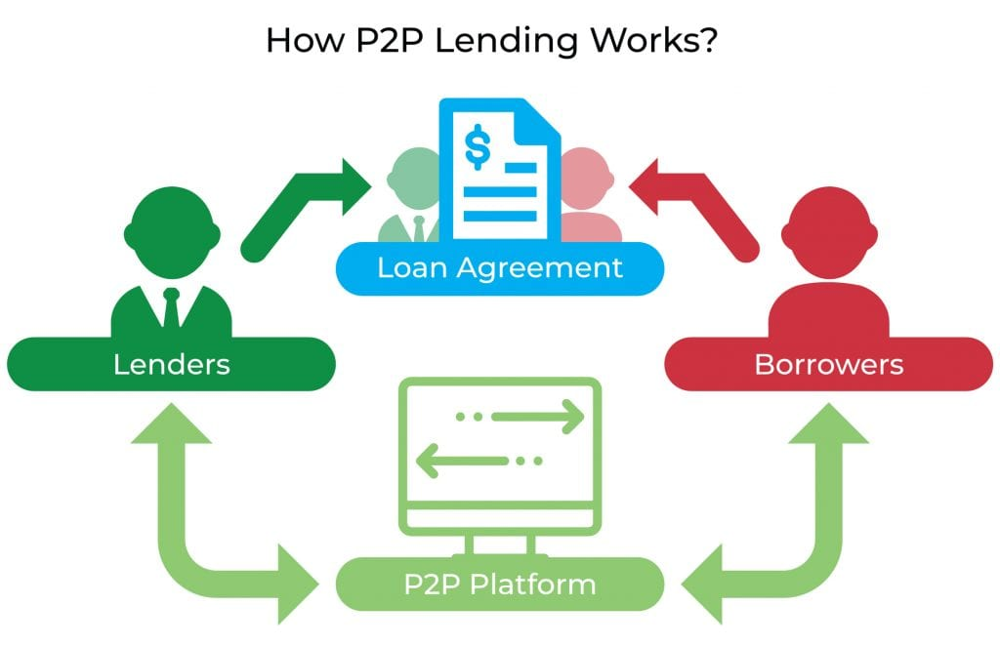
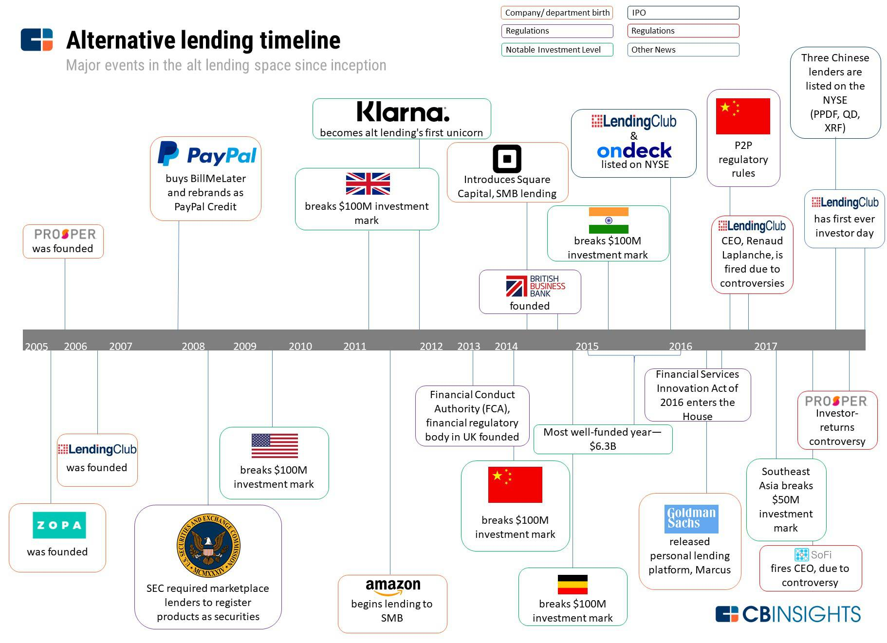
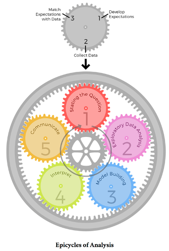

```{r setup, include=FALSE}
# We want the results to be hidden by default, though for some chunks we will override this to show the results
knitr::opts_chunk$set(warning = F, results = "hide", message = F)
```

# INTRODUCTION:

## What is Peer-to-Peer Lending?
See photo:  
 
Peer-to-peer (P2P) was a phenomenon less than ten years ago, exploding in popularity by offering a break from traditional banking. Individuals flocked to the alternative credit markets as alternative sources of funding and for new opportunities to finance their small business ventures.  Peer-to-peer (P2P) lending enables individuals to obtain loans directly from other individuals, cutting out the financial institution as the middleman. P2P lending is also known as “social lending” or “crowd lending.” It has only existed since 2005, but the crowd of competitors already includes Prosper, LendingClub, Upstart, and StreetShares. P2P lending websites connect borrowers directly to investors. The site sets the rates and terms and enables the transactions. P2P lenders are individual investors who want to get a better return on their cash savings than they would get from a bank savings account or certificate of deposit. P2P borrowers seek an alternative to traditional banks or a lower interest rate. The default rates for P2P loans are much higher than those in traditional finance. P2P lending websites connect borrowers directly to lenders. Each website sets the rates and the terms and enables the transaction. Most sites have a wide range of interest rates based on the creditworthiness of the applicant.
First, an investor opens an account with the site and deposits a sum of money to be dispersed in loans. The loan applicant posts a financial profile that is assigned a risk category that determines the interest rate the applicant will pay. The loan applicant can review offers and accept one. (Some applicants break up their requests into chunks and accept multiple offers.) The money transfer and the monthly payments are handled through the platform. The process can be entirely automated, or lenders and borrowers can choose to haggle.
Some sites specialize in particular types of borrowers. StreetShares, for example, is designed for small businesses.
And LendingClub has a “Patient Solutions” category that links doctors who offer financing programs with prospective patients.
Peer-to-peer lending is riskier than a savings account or certificate of deposit, but the interest rates are often much higher. This is because people who invest in a peer-to-peer lending site assume most of the risk, which is normally assumed by banks or other financial institutions.
Although direct P2P lending has undergone changes over recent years, it remains a viable option for borrowers and investors.
The global peer-to-peer lending market was worth 83.79 billion USD in 2021, according to figures from Precedence Research. This figure is projected to reach $705.81 billion by 2031.
The simplest way to invest in peer-to-peer lending is to make an account on a P2P lending site and begin lending money to borrowers. These sites typically let the lender choose the profile of their borrowers, so they can choose between high risk/high returns or more modest returns. Alternatively, many P2P lending sites are public companies, so one can also invest in them by buying their stock.
See photo:  
 


## Introducing the LendingClub:

See photo:  
 

LendingClub is a financial services company headquartered in San Francisco, California. It was the first peer-to-peer lender to register it LendingClub enabled borrowers to create unsecured personal loans between 1,000 USD and 40,000 USD. The standard loan period was three years. Investors were able to search and browse the loan listings on LendingClub website and select loans that they wanted to invest in based on the information supplied about the borrower, amount of loan, loan grade, and loan purpose. Investors made money from the interest on these loans. LendingClub made money by charging borrowers an origination fee and investors a service fees offerings as securities with the Securities and Exchange Commission, and to offer loan trading on a secondary market.
LendingClub screens potential borrowers and services the loans once they’re approved. The risk: Investors – not LendingClub – make the final decision whether or not to lend the money. That decision is based on the LendingClub grade, utilizing credit and income data, assigned to every approved borrower. That data, known only to the investors, also helps determine the range of interest rates offered to the borrower. LendingClub’s typical annual percentage rate (APR) is between 5.99% and 35.89%. There is also an origination fee of 1% to 6% taken off the top of the loan. Once approved, your loan amount will arrive at your bank account in about one week. There’s a monthly repayment schedule that stretches over three to five years (36-60 monthly payments). LendingClub loans are generally pursued by borrowers with good-to-excellent credit (scores average 700) and a low debt-to-income ratio (the average is 12%). Borrowers can file a joint application, which could lead to a larger loan line because of multiple incomes. LendingClub probably isn’t the best option for borrowers with bad credit. That would bring a high interest rate and steep origination fee, meaning you could probably do better with a different type of loan. 
See photo:  
 

Here,we are seeking to understand the factors that might have signaled risky loans or borrowing practices and could be consumed or applied by prospective borrowers, lenders, and/or investors considering participating in direct P2P via the LendingClub. 

## Our Data
Our dataset contains over 9,500 observations of loan data from LendingClub, the largest online platform for direct P2P lending.We have obtained the dataset from Kaggle. The link for the same is: [https://www.kaggle.com/datasets/urstrulyvikas/lending-club-loan-data-analysis]

P2P Lending rose to popularity in the years of 2007 to 2015 as can be seen in the timeline:
See photo:  


So, we believe that the timeframe of 2007 to 2015 provides the most relevant data for prospective individual investors today, particularly because it is unlikely to include a significant number of large institutional lenders. 

In our dataset the variables are defined as follows:

```{r results = "show"}
# This is copied form the Kaggle site
# We will use a kable table for simplicity
data_definitions <- data.frame(variable = c("credit.policy", "purpose", "int.rate", "installment", "log.annual.inc", "dti", "fico", "days.with.cr.line", "revol.bal", "revol.util", "inq.last.6mths", "delinq.2yrs", "pub.rec", "not.fully.paid"),
                          definition = c("1 if the customer meets the credit underwriting criteria of LendingClub.com, and 0 otherwise.",
                                         "The purpose of the loan (takes values creditcard, debtconsolidation, educational, majorpurchase, smallbusiness, and all_other).",
                                         "The interest rate of the loan, as a proportion (a rate of 11% would be stored as 0.11). Borrowers judged by LendingClub.com to be more risky are assigned higher interest rates.",
                                         "The monthly installments owed by the borrower if the loan is funded.",
                                         "The natural log of the self-reported annual income of the borrower.",
                                         "The debt-to-income ratio of the borrower (amount of debt divided by annual income).",
                                         "The FICO credit score of the borrower.",
                                         "The number of days the borrower has had a credit line.",
                                         "The borrower's revolving balance (amount unpaid at the end of the credit card billing cycle).",
                                         "The borrower's revolving line utilization rate (the amount of the credit line used relative to total credit available).",
                                         "The borrower's number of inquiries by creditors in the last 6 months.",
                                         "The number of times the borrower had been 30+ days past due on a payment in the past 2 years.",
                                         "The borrower's number of derogatory public records (bankruptcy filings, tax liens, or judgments).",
                                         "Whether the borrower will be fully paid or not."))

knitr::kable(data_definitions)
```


# EXPLORATORY DATA ANALYSIS or EDA:

As with any analysis ours will also start with formulation of the SMART QUESTION and Subsequent EDA.
By SMART QUESTION we mean a problem statement arising from out dataset that has the following characteristics:
1.Specific  
2.Measurable 
3.Achievable 
4.Relevant 
5.Time-Oriented 

See photo:  

To help us structure our EDA in an efficient way we have decided that, our exploratory data analysis will closely adhere to the 9-step^[Back to original]  checklist presented in Chapter 4 of *The Art of Data Science*.^[Peng, Roger D., and Elizabeth Matsui. “Chapter 4.” The Art of Data Science: A Guide for Anyone Who Works with Data, Skybrude Consulting LLC, Victoria, 2016, pp. 33–33.] 

These are the elements of our checklist:

1. Formulate our question
2. Read in our data
3. Check the packaging
4. Look at the top and the bottom of your data
5. Check your "n"s
6. Validate with at least one external data source
7. Make a plot
8. Try the easy solution first
9. Follow up

## 1.Formulate our question:

Our analysis will explore things such as income-to-debt ratios, credit score, interest rates, and delinquencies among direct P2P borrowers in an attempt to understand the risks and opportunities associated with P2P. Specifically, we intend to examine the impact that these variables have on who received loans and who defaulted on their loans between 2007 and 2015. We also intend on graphically depicting how the variables are related to each other. Our primary intention is to understand the dataset and answer few of the following questions :
1.	What variable or variables, if any, have an impact on if the person meets the credit underwriting criteria? How strong is that impact?
2.	What variable or variables, if any, have an impact on if the person fully repays the loan? How strong is that impact?
3.	Do borrowers who meet the credit underwriting criteria have a lower chance of not fully repaying the loan? If so, how big of a difference is it, and is it statistically significant?


## 2.Read in our data:

We start by loading the tidyverse and ezids libraries^[Our code requires the tidyverse and ezids libraries.] and reading on our dataset.
Please note we also require packages corrplot and scale to efficiently conduct our EDA.If we require any other packages we will import them along the way.

```{r}
library(ezids) # We will use functions form this package to get nicer looking results
library(tidyverse) # We need this package for data manipulation, piping, and graphing
library(corrplot) # We will need this package to plot the correlation matrix
library(scales) # This package will help us when labeling the scatter plots
library(gridExtra) # For additional table and image functionality
# Read in the data from the working directory
loans <- read_csv("loan_data.csv")
#loans
```


## 3.Check the packaging:

We can see that our dataset contains `r nrow(loans)` rows of data with `r ncol(loans)` columns. Next let's examine the structure of the dataset. This will give us a better understanding of what we are dealing with. This is essentially a comprehensive preview of the type of the variables in our data and one of the introductory steps of any EDA.

```{r results = "show"}
# There is unfortunately no ezids function to see the result in a nice looking table, so we will use the standard function.
str(loans)
```

By examining the structure of our data, we can see that there is only one character variable which might be a factor, and some of the numeric variables look like logicals.


## 4.Look at the top and the bottom of your data:

We can also look at the top and bottom rows of our dataset to get a better feel for the data. This will help us better understand the values in our dataset and how to most effectively deal with them.

The first 5 observations of our dataset are as follows:
```{r results = "show"}
# We use the xkabledplyhead() function form the ezids package to see the result in a nice looking table.
xkabledplyhead(loans)
```

The bottom 5 observations of our dataset are as follows:
```{r results = "show"}
# We use the xkabledplytail() function form the ezids package to see the result in a nice looking table.
xkabledplytail(loans)
```

The top and bottom rows of our dataset indicate the data is structured in an acceptable way and that our variables match up with the values for each column. This means we can now move on to the descriptive statistics part of our EDA.

## 5.Check your "n"s:

We can get some descriptive statistics of the variables to help us better understand the data.
The xkablesummary() gives us the 5 point summary of the dataset and the mean.
```{r results = "show"}
# We use the xkablesummary() function from the ezids package to see the result in a nice looking table.
xkablesummary(loans)
```

From this we can see that some of the variables that appeared to be logicals, like inq.last.6mths, delinq.2yrs, and pub.rec are actually not. However,credit.policy and not.fully.paid is.

We have an idea of what to expect for a few variables, such as interest rate and credit score, so we were able to test the dataset against some of our expectations to gauge its reliability. By inspecting the dataframe, we can see that interest rates for the data are between `r paste0(min(loans$int.rate)*100,"%")` and `r paste0(max(loans$int.rate)*100,"%")` and credit scores range from `r min(loans$fico)` to `r max(loans$fico)`. Although interest rates might seem to reach excessively high rates or credit scores too meager, the P2P market tended to consist of more risky loans. This aligned with our expectation and reinforced our confidence in the dataset. 

The range of the utilization, or the percent of credit being used, is between `r paste0(min(loans$revol.util), "%")` and `r paste0(max(loans$revol.util), "%")`. Someone utilizing more than 100% of the credit available to them initially seemed erroneous; however, this can occur from technical error, creditors and collectors reporting at different date/times, borrowers opening and closing credit lines, or possibly when borrowers appear as authorized users of others’ credit lines. Regardless, only `r sum(loans$revol.util > 100)` loans within our dataset appear to exceed the standard maximum of 100% so we do not expect this to have a significant effect on our analysis, thereby allowing us to move on to the next step of our EDA.

But, before we move on we wanted to see the a measure of dispersion/variation namely standard deviation for the numeric variables as a part of descriptive statistics section of our EDA. They are as follows:

```{r results = "show"}
library(expss)

tab = loans %>%
   tab_cells(credit.policy,int.rate, installment, log.annual.inc, dti, fico ,days.with.cr.line,revol.bal,revol.util,inq.last.6mths,delinq.2yrs,pub.rec,not.fully.paid) %>%
  tab_cols() %>% 
    tab_stat_sd(label = "Std. dev.") %>%
    tab_pivot() %>% 
    set_caption("Table with Standard Deviation of all numeric variables.")
tab
png("sd.png", height=700, width=700)
p<-tableGrob(tab)
grid.arrange(p)
dev.off()
```


## 6.Validate with at least one external data source:

According to the Kaggle site where we got this dataset from, there are 9,578 rows and 14 columns, which matches what we have. The site also shows that there is no missing data. Let's verify that by adding the total number of missing cells in the dataset, which is `r sum(is.na(loans))`, and check the total number of null cells, which is `r sum(is.null(loans))`. We can also check if the observations are unique, and we see that all `r nrow(unique(loans))` rows are unique.


## 7.Make a plot:

Let's start by making a histogram for each non-logical numeric variable.

```{r fig.width=8}
# By gathering the variables we want to see into a long format with the gather() function, we can then create a histogram
# for each variable using the facet_wrap() function in ggplot2.
loans %>%
  select(int.rate, installment, log.annual.inc, dti, fico, days.with.cr.line, revol.bal, revol.util,
           inq.last.6mths, delinq.2yrs, pub.rec) %>%
  gather(variable, value) %>%
  ggplot(aes(x = value)) +
  geom_histogram(fill = "steelblue", color = "black") +
  facet_wrap(~ variable, scales = "free") + # Free scales so the graphs are readable
  labs(title = "Histograms of Numeric Variables", x = "Value", y = "Count") +
  theme_minimal()
```

Some of these variables look somewhat normal, and it would make sense to create a QQ-Plot for them later. But first let's create boxplots for these same variables.

```{r fig.width=8}
# By gathering the variables we want to see into a long format with the gather() function, we can then create a boxplot
# for each variable using the facet_wrap() function in ggplot2.
loans %>%
  select(int.rate, installment, log.annual.inc, dti, fico, days.with.cr.line, revol.bal, revol.util,
           inq.last.6mths, delinq.2yrs, pub.rec) %>%
  gather(variable, value) %>%
  ggplot(aes(x = value)) +
  geom_boxplot(fill = "steelblue", color = "black",
               outlier.size = 2, outlier.alpha = 0.2) + # Translucent and larger outliers to help with overplotting
  facet_wrap(~ variable, scales = "free") + # Free scales so the graphs are readable
  labs(title = "Boxplots of Numeric Variables", x = "Value") +
  theme_minimal() +
  theme(axis.text.y = element_blank(), axis.ticks.y = element_blank())
```

We can see that some of these variables have issues with outliers.

Now let's look at the Factor and logical variables with bar charts.

```{r fig.width=8}
# By gathering the variables we want to see into a long format with the gather() function, we can then create a bar graph
# for each variable using the facet_wrap() function in ggplot2.
loans %>%
  select(credit.policy, purpose, not.fully.paid) %>%
  gather(variable, value) %>%
  ggplot(aes(x = value)) +
  geom_bar(fill = "steelblue", color = "black") +
  facet_wrap(~ variable, scales = "free") + # Free scales so the graphs are readable
  coord_flip() +
  labs(title = "Bar Charts of Non-Numeric Variables", x = "Value", y = "Count") +
  theme_minimal() +
  theme()
```

From this we can see that the `purpose` variable would be a good candidate to perform ANOVA tests on. 


## Try the easy solution first
Let's try the easy way of looking at meeting the credit underwriting criteria vs the borrower fully paying. We can group by the credit.policy variable, and calculate the percentage of borrowers in each category who did not fully pay.
```{r results = "Show"}
# We will convert the average to an easier to read percentage by multiplying by 100, rounding, and adding a "%" at the end.
loans %>%
  group_by(credit.policy) %>%
  summarize(percent_not_fully_paid = paste0(round(100*mean(not.fully.paid), 1), "%"))  %>%
  ungroup() %>%
  knitr::kable(align = "c")
```


From this we can see that about 13.2% of borrowers who met the credit underwriting criteria did not fully pay, while for the borrowers who did not meet the credit underwriting criteria about 27.8% did not fully pay. 

This indicates borrowers who did not meet the credit underwriting criteria were almost twice as likely to be default on their loans than those who did meet the criteria. For comparison, default rates on loans from commercial banks for the same period as our dataset averaged 4.48%, with a maximum default rate of 7.49% default rate towards the end of 2009, according to the St. Louis Federal Reserve Bank.^[https://fred.stlouisfed.org/series/DRALACBN#]


## Follow up

Let us go back to the table of data definitions and add a column for the variable type.

```{r}
# Add a type column and reorder it so that definition is last
data_definitions_augmented <- data_definitions %>%
  mutate(type = c("Logical", "Factor", "Numeric", "Numeric", "Numeric", "Numeric", "Integer", "Numeric", "Integer", "Numeric", "Integer", "Integer", "Integer", "Logical")) %>%
  select(variable, type, definition)
```

```{r results = "show"}
# We will use a kable table for simplicity
knitr::kable(data_definitions_augmented)
```


Let's also convert some of the variables to a more appropriate type. the `credit.policy` and `not.fully.paid` variables are logicals, and the `purpose` variable we will use as a factor.
```{r}
# These variables may act differently from here on out
loans$credit.policy <- as.logical(loans$credit.policy)
loans$not.fully.paid <- as.logical(loans$not.fully.paid)

loans$purpose <- as.factor(loans$purpose)
```

Now we can further explore the data to see how the numeric variables differ based on the on the `credit.policy`, `not.fully.paid`, and `purpose` variables. Let's make some boxplots to visualize this.

### Additional Boxplots
```{r}
# By gathering the variables we want to see into a long format with the gather() function, we can then create a boxplot
# for each variable using the facet_wrap() function in ggplot2. We can see this for each credit policy value by excluding
# it in the gather() function.
loans %>%
  select(int.rate, installment, log.annual.inc, dti, fico, days.with.cr.line, revol.bal, revol.util,
           inq.last.6mths, delinq.2yrs, pub.rec, credit.policy) %>%
  gather(variable, value, -credit.policy) %>%
  ggplot(aes(x = value, y = as.logical(credit.policy), fill = as.logical(credit.policy))) +
  geom_boxplot(outlier.size = 2, outlier.alpha = 0.2) +  # Translucent and larger outliers to help with overplotting
  guides(fill = guide_legend(reverse = TRUE)) + # So the legend order matches the order in the graphs
  facet_wrap(~ variable, scales = "free_x") + # Free x scale so the graphs are readable
  labs(title = "Boxplots of Numeric Variables", subtitle = "Comparing `credit.policy` Values",
       x = "Value", y = "Count", fill = "Credit Policy") +
  theme_minimal()

# By gathering the variables we want to see into a long format with the gather() function, we can then create a boxplot
# for each variable using the facet_wrap() function in ggplot2. We can see this for each not fully paid value by excluding
# it in the gather() function.
loans %>%
  select(int.rate, installment, log.annual.inc, dti, fico, days.with.cr.line, revol.bal, revol.util,
           inq.last.6mths, delinq.2yrs, pub.rec, not.fully.paid) %>%
  gather(variable, value, -not.fully.paid) %>%
  ggplot(aes(x = value, y = as.logical(not.fully.paid), fill = as.logical(not.fully.paid))) +
  geom_boxplot(outlier.size = 2, outlier.alpha = 0.2) +  # Translucent and larger outliers to help with overplotting
  guides(fill = guide_legend(reverse = TRUE)) + # So the legend order matches the order in the graphs
  facet_wrap(~ variable, scales = "free_x") + # Free x scale so the graphs are readable
  labs(title = "Boxplots of Numeric Variables", subtitle = "Comparing `not.fully.paid` Values",
       x = "Value", y = "Count", fill = "Not Fully Paid") +
  theme_minimal()

# By gathering the variables we want to see into a long format with the gather() function, we can then create a boxplot
# for each variable using the facet_wrap() function in ggplot2. We can see this for each purpose value by excluding
# it in the gather() function.
loans %>%
  select(int.rate, installment, log.annual.inc, dti, fico, days.with.cr.line, revol.bal, revol.util,
           inq.last.6mths, delinq.2yrs, pub.rec, purpose) %>%
  gather(variable, value, -purpose) %>%
  ggplot(aes(x = value, y = purpose, fill = purpose)) +
  geom_boxplot(outlier.size = 2, outlier.alpha = 0.2) +
  guides(fill = guide_legend(reverse = TRUE)) + # So the legend order matches the order in the graphs
  facet_wrap(~ variable, scales = "free_x") + # Free x scale so the graphs are readable
  labs(title = "Boxplots of Numeric Variables", subtitle = "Comparing `purpose` Values",
       x = "Value", y = "Count", fill = "Purpose") +
  theme_minimal()
```


### Covariance Matrix

```{r results = "show"}
loans_covarience_matrix <- loans %>%
  select(-purpose) %>%
  cov()
loans_covarience_matrix
png("loans_covarience_matrix.png", height=2000, width=2000)
p<-tableGrob(loans_covarience_matrix)
grid.arrange(p)
dev.off()
```


### Correlation Matrix and Heatmap

```{r fig.width=7, fig.height=7}
# For our correlation matrix we want to include everything but the purpose variable
loans_correlation_matrix <- loans %>%
  select(-purpose) %>%
  cor()
loans_correlation_matrix
png("loans_correlation_matrix.png", height=2000, width=2000)
p<-tableGrob(loans_correlation_matrix)
grid.arrange(p)
dev.off()

# The mixed correlation plot makes a nice visualization
corrplot.mixed(loans_correlation_matrix, tl.pos = "lt")
```

### Scatter Plots
```{r}
loans %>%
  ggplot(aes(x = fico, y = int.rate)) +
  geom_point(color = "steelblue", alpha = 0.2) +
  labs(title = "Interest Rate vs FICO Score",
       x = "FICO Score", y = "Interest Rate") +
  scale_x_continuous(limits = c(600, NA), expand = expansion(mult = c(0, .05))) +
  scale_y_continuous(labels = label_percent(), limits = c(.05, NA), expand = expansion(mult = c(0, .05))) +
  theme_minimal()

loans %>%
  ggplot(aes(x = int.rate, y = revol.util)) +
  geom_point(color = "steelblue", alpha = 0.2) +
  labs(title = "Revolving Line Utilization Rate vs Interest Rate",
       x = "Interest Rate", y = "Revolving Line Utilization Rate") +
  scale_x_continuous(labels = label_percent(), limits = c(.05, NA), expand = expansion(mult = c(0, .05))) +
  scale_y_continuous(labels = label_percent(scale = 1)) +
  theme_minimal()

loans %>%
  ggplot(aes(x = log.annual.inc, y = installment)) +
  geom_point(color = "steelblue", alpha = 0.2) +
  labs(title = "Installment vs Log of Annual Income",
       x = "Log of Annual Income", y = "Installment") +
  theme_minimal()

loans %>%
  ggplot(aes(x = fico, y = revol.util)) +
  geom_point(color = "steelblue", alpha = 0.2) +
  labs(title = "Revolving Line Utilization Rate vs FICO Score",
       x = "FICO Score", y = "Revolving Line Utilization Rate") +
  scale_x_continuous(limits = c(600, NA), expand = expansion(mult = c(0, .05))) +
  scale_y_continuous(labels = label_percent(scale = 1)) +
  theme_minimal()
```


# STATISTICAL TEST:
Interpretation^[https://towardsdatascience.com/end-to-end-case-study-classification-lending-club-data-489f8a1b100a] ^[https://towardsdatascience.com/turning-lending-clubs-worst-loans-into-investment-gold-475ec97f58ee] ^[https://www.debt.org/credit/loans/personal/lending-club-review/] ^[https://nycdatascience.com/blog/student-works/lendingclub-profitability-predictions/] ^[https://nycdatascience.com/blog/student-works/project-1-analysis-of-lending-clubs-data/] ^[https://michel-kana.medium.com/lendingclub-bias-in-data-machine-learning-and-investment-strategy-3a3bd1c65f0]


## T-Tests

A t-test is a statistical test that compares the means of two samples. It is used in hypothesis testing, with a null hypothesis that the difference in group means is zero and an alternate hypothesis that the difference in group means is different from zero.
We can perform t-tests for each numeric variable in our dataset. Not all of the results may be useful, but we want to have them available for further consideration.

=======
## T-tests:
```{r results = "show"}

library(broom)
library(purrr)

ttest95rate = t.test(x=loans$int.rate) # default conf.level = 0.95
ttest99rate = t.test(x=loans$int.rate, conf.level=0.99 )
ttest50rate = t.test(x=loans$int.rate, conf.level=0.50 )

tab <- map_df(list(ttest95rate, ttest99rate, ttest50rate),tidy)
tab
png("t1.png", height=100, width=700)
p<-tableGrob(tab)
grid.arrange(p)
dev.off()
```

```{r results = "show"}
ttest95installment = t.test(x=loans$installment) # default conf.level = 0.95
ttest99installment = t.test(x=loans$installment, conf.level=0.99 )
ttest50installment = t.test(x=loans$installment, conf.level=0.50 )

tab <- map_df(list(ttest95installment,ttest99installment,ttest50installment), tidy)
tab
png("t2.png", height=100, width=700)
p<-tableGrob(tab)
grid.arrange(p)
dev.off()
```

```{r results = "show"}
ttest95annual = t.test(x=loans$log.annual.inc) # default conf.level = 0.95
ttest99annual = t.test(x=loans$log.annual.inc, conf.level=0.99 )
ttest50annual = t.test(x=loans$log.annual.inc, conf.level=0.50 )

tab <- map_df(list(ttest95annual,ttest99annual,ttest50annual), tidy)
tab
png("t3.png", height=100, width=700)
p<-tableGrob(tab)
grid.arrange(p)
dev.off()
```

```{r results = "show"}
ttest95fico = t.test(x=loans$fico) # default conf.level = 0.95
ttest99fico = t.test(x=loans$fico, conf.level=0.99 )
ttest50fico = t.test(x=loans$fico, conf.level=0.50 )

tab <- map_df(list(ttest95fico,ttest99fico,ttest50fico), tidy)
tab
png("t4.png", height=100, width=700)
p<-tableGrob(tab)
grid.arrange(p)
dev.off()
```

```{r results = "show"}
ttest95dti = t.test(x=loans$dti) # default conf.level = 0.95
ttest99dti = t.test(x=loans$dti, conf.level=0.99 )
ttest50dti = t.test(x=loans$dti, conf.level=0.50 )

tab <- map_df(list(ttest95dti,ttest99dti,ttest50dti), tidy)
tab
png("t5.png", height=100, width=700)
p<-tableGrob(tab)
grid.arrange(p)
dev.off()
```

```{r results = "show"}
ttest95days.with.cr.line = t.test(x=loans$days.with.cr.line) # default conf.level = 0.95
ttest99days.with.cr.line = t.test(x=loans$days.with.cr.line, conf.level=0.99 )
ttest50days.with.cr.line = t.test(x=loans$days.with.cr.line, conf.level=0.50 )


tab <- map_df(list(ttest95days.with.cr.line,ttest99days.with.cr.line,ttest50days.with.cr.line), tidy)
tab
png("t6.png", height=100, width=700)
p<-tableGrob(tab)
grid.arrange(p)
dev.off()
```

```{r results = "show"}
ttest95revol.bal = t.test(x=loans$revol.bal) # default conf.level = 0.95
ttest99revol.bal = t.test(x=loans$revol.bal, conf.level=0.99 )
ttest50revol.bal = t.test(x=loans$revol.bal, conf.level=0.50 )

tab <- map_df(list(ttest95revol.bal,ttest99revol.bal,ttest50revol.bal), tidy)
tab
png("t7.png", height=100, width=700)
p<-tableGrob(tab)
grid.arrange(p)
dev.off()
```

```{r results = "show"}
ttest95revol.util = t.test(x=loans$revol.util) # default conf.level = 0.95
ttest99revol.util = t.test(x=loans$revol.util, conf.level=0.99 )
ttest50revol.util = t.test(x=loans$revol.util, conf.level=0.50 )

tab <- map_df(list(ttest95revol.util,ttest99revol.util,ttest50revol.util), tidy)
tab
png("t8.png", height=100, width=700)
p<-tableGrob(tab)
grid.arrange(p)
dev.off()
```

```{r results = "show"}
ttest95inq.last.6mths = t.test(x=loans$inq.last.6mths) # default conf.level = 0.95
ttest99inq.last.6mths = t.test(x=loans$inq.last.6mths, conf.level=0.99 )
ttest50inq.last.6mths = t.test(x=loans$inq.last.6mths, conf.level=0.50 )

tab <- map_df(list(ttest95inq.last.6mths,ttest99inq.last.6mths,ttest50inq.last.6mths), tidy)
tab
png("t9.png", height=100, width=700)
p<-tableGrob(tab)
grid.arrange(p)
dev.off()
```

```{r results = "show"}
ttest95delinq.2yrs = t.test(x=loans$delinq.2yrs) # default conf.level = 0.95
ttest99delinq.2yrs = t.test(x=loans$delinq.2yrs, conf.level=0.99 )
ttest50delinq.2yrs = t.test(x=loans$delinq.2yrs, conf.level=0.50 )

tab <- map_df(list(ttest95delinq.2yrs,ttest99delinq.2yrs,ttest50delinq.2yrs), tidy)
tab
png("t10.png", height=100, width=700)
p<-tableGrob(tab)
grid.arrange(p)
dev.off()
```

```{r results = "show"}
ttest95pub.rec = t.test(x=loans$pub.rec) # default conf.level = 0.95
ttest99pub.rec = t.test(x=loans$pub.rec, conf.level=0.99 )
ttest50pub.rec = t.test(x=loans$pub.rec, conf.level=0.50 )

tab <- map_df(list(ttest95pub.rec,ttest99pub.rec,ttest50pub.rec), tidy)
tab
png("t11.png", height=100, width=700)
p<-tableGrob(tab)
grid.arrange(p)
dev.off()
```

## ANOVA Tests


ANOVA stands for Analysis of Variance. It's a statistical test that was developed by Ronald Fisher in 1918 and has been in use ever since. Put simply, ANOVA tells you if there are any statistical differences between the means of three or more independent groups. One-way ANOVA is the most basic form.
Tukey's Honest Significant Difference (HSD) test is a post hoc test commonly used to assess the significance of differences between pairs of group means. Tukey HSD is often a follow up to one-way ANOVA, when the F-test has revealed the existence of a significant difference between some of the tested groups..
The `purpose` variable in our data is a good candidate to perform ANOVA tests with. We will do an ANOVA test for each variable based on `purpose`. We will also be doing Tuckey tests here. Again not all of the results may be useful, but we want to have them available for further consideration.

```{r results = "show"}
aovrate=aov(int.rate ~ purpose, data = loans)
aovratesummary=summary(aovrate)
aovratesummary
aovrateturkey=TukeyHSD(aovrate)
aovrateturkey
```

```{r results = "show"}
aovinstallment=aov(installment ~ purpose, data = loans)
aovinstallmentsummary=summary(aovinstallment)
aovinstallmentsummary
aovinstallmentturkey=TukeyHSD(aovinstallment)
aovinstallmentturkey
```

```{r results = "show"}
aovannual=aov(log.annual.inc ~ purpose, data = loans)
aovannualsummary=summary(aovannual)
aovannualsummary
aovannualturkey=TukeyHSD(aovannual)
aovannualturkey
```

```{r results = "show"}
aovdti=aov(dti ~ purpose, data = loans)
aovdtisummary=summary(aovdti)
aovdtisummary
aovdtiturkey=TukeyHSD(aovdti)
aovdtiturkey
```

```{r results = "show"}
aovfico=aov(fico ~ purpose, data = loans)
aovficosummary=summary(aovfico)
aovficosummary
aovficoturkey=TukeyHSD(aovfico)
aovficoturkey
```

```{r results = "show"}
aovcrline=aov(days.with.cr.line ~ purpose, data = loans)
aovcrlinesummary=summary(aovcrline)
aovcrlinesummary
aovcrlineturkey=TukeyHSD(aovcrline)
aovcrlineturkey
```

```{r results = "show"}
aovrbal=aov(revol.bal ~ purpose, data = loans)
aovrbalsummary=summary(aovrbal)
aovrbalsummary
aovrbalturkey=TukeyHSD(aovrbal)
aovrbalturkey
```

```{r results = "show"}
aovrutil=aov(revol.util ~ purpose, data = loans)
aovrutilsummary=summary(aovrutil)
aovrutilsummary
aovrutilturkey=TukeyHSD(aovrutil)
aovrutilturkey
```

```{r results = "show"}
aov6mts=aov(inq.last.6mths ~ purpose, data = loans)
aov6mtssummary=summary(aov6mts)
aov6mtssummary
aov6mtsturkey=TukeyHSD(aov6mts)
aov6mtsturkey
```

```{r results = "show"}
aov2yrs=aov(delinq.2yrs ~ purpose, data = loans)
aov2yrssummary=summary(aov2yrs)
aov2yrssummary
aov2yrsturkey=TukeyHSD(aov2yrs)
aov2yrsturkey
```

```{r results = "show"}
aovpubrec=aov(pub.rec ~ purpose, data = loans)
aovpubrecsummary=summary(aovpubrec)
aovpubrecsummary
aovpubrecturkey=TukeyHSD(aovpubrec)
aovpubrecturkey
```


## Chi Squared Test

The Chi-square test of Independence determines whether there is an association between two categorical variables i.e. whether the variables are independent or related. 

chi-square test for purpose vs credit policy

```{r results = "show"}
test = chisq.test(table(loans$purpose,loans$credit.policy))
test
test$observed
test$expected
test$residuals

corrplot(test$residuals, is.cor = FALSE)
```
Since the p-value between “purpose” and “credit policy” is less than our chosen significance level of (α = 0.05), we can reject the null hypothesis. We can conclude that there is enough evidence to suggest an association between “purpose” and “credit policy".

chi-square test for purpose vs not fully paid

```{r results = "show"}
test = chisq.test(table(loans$purpose,loans$not.fully.paid))
test

test$observed
test$expected
test$residuals

corrplot(test$residuals, is.cor = FALSE)
```
Since the p-value between “purpose” and “not fully paid” is less than our chosen significance level of (α = 0.05), we can reject the null hypothesis. We can conclude that there is enough evidence to suggest an association between “purpose” and “not fully paid".


chi-square test for credit policy vs not fully paid

```{r results = "show"}
test = chisq.test(table(loans$credit.policy,loans$not.fully.paid))
test

test$observed
test$expected
test$residuals

corrplot(test$residuals, is.cor = FALSE)
```
Since the p-value between “credit policy” and “not fully paid” is less than our chosen significance level of (α = 0.05), we can reject the null hypothesis. We can conclude that there is enough evidence to suggest an association between “credit policy” and “not fully paid.


## Q-Q Plots for normality test:

We want to create a Q-Q plot for each numeric variable so we can perform a normality test for each.Please, note that the easiest way to interpret the findings is how closely the data resembles the black reference line representing the normal distribution for the variable.

```{r}
# By gathering the variables we want to see into a long format with the gather() function, we can then create a Q-Q plot
# for each variable using the facet_wrap() function in ggplot2.
loans %>%
  select(int.rate, installment, log.annual.inc, dti, fico, days.with.cr.line, revol.bal, revol.util,
           inq.last.6mths, delinq.2yrs, pub.rec) %>%
  gather(variable, value) %>%
  ggplot(aes(sample = value)) +
  geom_qq(color = "steelblue") +
  geom_qq_line() +
  facet_wrap(~ variable, scales = "free") + # Free scales so the graphs are readable
  labs(title = "Q-Q Plots of Numeric Variables", x = "Theoretical", y = "Sample") +
  theme_minimal()
```


# CONCLUSION AND NEXT STEPS:

Risks to our analysis and opportunities for future analyses:

Private individuals historically made up the bulk of lenders in P2P markets. However, high interest rates and the prospects of risky borrowers undermined P2P lending as a legitimate financial industry. Combined with the urge for more growth by intermediaries like LendingClub, these concerns began to prompt higher lending standards and discussions about more regulation. 

By 2017, shortly after the peak of the P2P industry, larger institutions and banks began to take over private individuals as the primary sources of lending in P2P markets. We suspect/assume this shift in P2P lenders altered the makeup of who receives what, thereby rendering recent research on P2P loans as an investment opportunity less reliable as a guide for today’s prospective individual investors.

# FOLLOW-UP :

## Revolving Balance

While the annual income data was given to us as a log, the revolving balance was given to use unmodified. We discovered that taking the log of of the `revol.bal` variable gives a better result that looks more normal, but encountered an issue. There are some loans with `revol.bal` value of 0, and when you take the log of that you get -Inf. We will need to decide how to handle this in the future. For now, we want to demonstrate the results of taking the log of `revol.bal`and how it increases the readability of the data and the variable resebles a normal distribution when is always a good characteristics for further modelling.

```{r}
loans$revol.bal=log(loans$revol.bal)
loans %>%
  select(int.rate, installment, log.annual.inc, dti, fico, days.with.cr.line, revol.bal, revol.util,
           inq.last.6mths, delinq.2yrs, pub.rec) %>%
  gather(variable, value) %>%
  ggplot(aes(x = value)) +
  geom_histogram(fill = "steelblue", color = "black") +
  facet_wrap(~ variable, scales = "free") + # Free scales so the graphs are readable
  labs(title = "Histograms of Numeric Variables", x = "Value", y = "Count") +
  theme_minimal()

loans %>%
  select(int.rate, installment, log.annual.inc, dti, fico, days.with.cr.line, revol.bal, revol.util,
           inq.last.6mths, delinq.2yrs, pub.rec) %>%
  gather(variable, value) %>%
  ggplot(aes(x = value)) +
  geom_boxplot(fill = "steelblue", color = "black",
               outlier.size = 2, outlier.alpha = 0.2) + # Translucent and larger outliers to help with overplotting
  facet_wrap(~ variable, scales = "free") + # Free scales so the graphs are readable
  labs(title = "Boxplots of Numeric Variables", x = "Value") +
  theme_minimal() +
  theme(axis.text.y = element_blank(), axis.ticks.y = element_blank())

# By gathering the variables we want to see into a long format with the gather() function, we can then create a boxplot
# for each variable using the facet_wrap() function in ggplot2. We can see this for each credit policy value by excluding
# it in the gather() function.
loans %>%
  select(int.rate, installment, log.annual.inc, dti, fico, days.with.cr.line, revol.bal, revol.util,
           inq.last.6mths, delinq.2yrs, pub.rec, credit.policy) %>%
  gather(variable, value, -credit.policy) %>%
  ggplot(aes(x = value, y = as.logical(credit.policy), fill = as.logical(credit.policy))) +
  geom_boxplot(outlier.size = 2, outlier.alpha = 0.2) +  # Translucent and larger outliers to help with overplotting
  guides(fill = guide_legend(reverse = TRUE)) + # So the legend order matches the order in the graphs
  facet_wrap(~ variable, scales = "free_x") + # Free x scale so the graphs are readable
  labs(title = "Boxplots of Numeric Variables", subtitle = "Comparing `credit.policy` Values",
       x = "Value", y = "Count", fill = "Credit Policy") +
  theme_minimal()

# By gathering the variables we want to see into a long format with the gather() function, we can then create a boxplot
# for each variable using the facet_wrap() function in ggplot2. We can see this for each not fully paid value by excluding
# it in the gather() function.
loans %>%
  select(int.rate, installment, log.annual.inc, dti, fico, days.with.cr.line, revol.bal, revol.util,
           inq.last.6mths, delinq.2yrs, pub.rec, not.fully.paid) %>%
  gather(variable, value, -not.fully.paid) %>%
  ggplot(aes(x = value, y = as.logical(not.fully.paid), fill = as.logical(not.fully.paid))) +
  geom_boxplot(outlier.size = 2, outlier.alpha = 0.2) +  # Translucent and larger outliers to help with overplotting
  guides(fill = guide_legend(reverse = TRUE)) + # So the legend order matches the order in the graphs
  facet_wrap(~ variable, scales = "free_x") + # Free x scale so the graphs are readable
  labs(title = "Boxplots of Numeric Variables", subtitle = "Comparing `not.fully.paid` Values",
       x = "Value", y = "Count", fill = "Not Fully Paid") +
  theme_minimal()

# By gathering the variables we want to see into a long format with the gather() function, we can then create a boxplot
# for each variable using the facet_wrap() function in ggplot2. We can see this for each purpose value by excluding
# it in the gather() function.
loans %>%
  select(int.rate, installment, log.annual.inc, dti, fico, days.with.cr.line, revol.bal, revol.util,
           inq.last.6mths, delinq.2yrs, pub.rec, purpose) %>%
  gather(variable, value, -purpose) %>%
  ggplot(aes(x = value, y = purpose, fill = purpose)) +
  geom_boxplot(outlier.size = 2, outlier.alpha = 0.2) +
  guides(fill = guide_legend(reverse = TRUE)) + # So the legend order matches the order in the graphs
  facet_wrap(~ variable, scales = "free_x") + # Free x scale so the graphs are readable
  labs(title = "Boxplots of Numeric Variables", subtitle = "Comparing `purpose` Values",
       x = "Value", y = "Count", fill = "Purpose") +
  theme_minimal()

loans %>%
  select(int.rate, installment, log.annual.inc, dti, fico, days.with.cr.line, revol.bal, revol.util,
           inq.last.6mths, delinq.2yrs, pub.rec) %>%
  gather(variable, value) %>%
  ggplot(aes(sample = value)) +
  geom_qq(color = "steelblue") +
  geom_qq_line() +
  facet_wrap(~ variable, scales = "free") + # Free scales so the graphs are readable
  labs(title = "Q-Q Plots of Numeric Variables", x = "Theoretical", y = "Sample") +
  theme_minimal()
```

# ANNEXURE:

We performed z-interval tests for each variable, but decided that t-interval was more appropriate. We are keeping the code here so that we don't lose the work.Please note that in this case z test is not appropriate because we do not have an idea about the standard deviation of the population. However, in order to better understand the working algorithm of the statistical tests especially the z-score or the z-statistics and how it compares to the t-statistics.

## Z-tests:

```{r results = "show"}
loans$revol.bal=exp(loans$revol.bal)
# This code will perform the z-interval tests we want, but  we will show the results in a nicer looking table format
# For the purpose of these z-interval tests we are assuming that the data is normal and therefore has a standard deviation of 2.31
loadPkg("BSDA")
ztest95rate = z.test(x=loans$int.rate, sigma.x = sd(loans$int.rate)) # default conf.level = 0.95
ztest99rate = z.test(x=loans$int.rate, sigma.x = 2.31, conf.level=0.99 )
ztest50rate = z.test(x=loans$int.rate, sigma.x = 2.31, conf.level=0.50 )

tab <- map_df(list(ztest95rate, ztest99rate, ztest50rate), tidy)
tab
png("z1.png", height=100, width=700)
p<-tableGrob(tab)
grid.arrange(p)
dev.off()
```


```{r results = "show"}
ztest95installment = z.test(x=loans$installment, sigma.x = 2.31) # default conf.level = 0.95
ztest99installment = z.test(x=loans$installment, sigma.x = 2.31, conf.level=0.99 )
ztest50installment = z.test(x=loans$installment, sigma.x = 2.31, conf.level=0.50 )

tab <- map_df(list(ztest95installment,ztest99installment,ztest50installment), tidy)
tab
png("z2.png", height=100, width=700)
p<-tableGrob(tab)
grid.arrange(p)
dev.off()
```

```{r results = "show"}
ztest95annual = z.test(x=loans$log.annual.inc, sigma.x = 2.31) # default conf.level = 0.95
ztest99annual = z.test(x=loans$log.annual.inc, sigma.x = 2.31, conf.level=0.99 )
ztest50annual = z.test(x=loans$log.annual.inc, sigma.x = 2.31, conf.level=0.50 )

tab <- map_df(list(ztest95annual,ztest99annual,ztest50annual), tidy)
tab
png("z3.png", height=100, width=700)
p<-tableGrob(tab)
grid.arrange(p)
dev.off()
```

```{r results = "show"}
ztest95fico = z.test(x=loans$fico, sigma.x = 2.31) # default conf.level = 0.95
ztest99fico = z.test(x=loans$fico, sigma.x = 2.31, conf.level=0.99 )
ztest50fico = z.test(x=loans$fico, sigma.x = 2.31, conf.level=0.50 )

tab <- map_df(list(ztest95fico,ztest99fico,ztest50fico), tidy)
tab
png("z4.png", height=100, width=700)
p<-tableGrob(tab)
grid.arrange(p)
dev.off()
```

```{r results = "show"}
ztest95dti = z.test(x=loans$dti, sigma.x = 2.31) # default conf.level = 0.95
ztest99dti = z.test(x=loans$dti, sigma.x = 2.31, conf.level=0.99 )
ztest50dti = z.test(x=loans$dti, sigma.x = 2.31, conf.level=0.50 )

tab <- map_df(list(ztest95dti,ztest99dti,ztest50dti), tidy)
tab
png("z5.png", height=100, width=700)
p<-tableGrob(tab)
grid.arrange(p)
dev.off()
```

```{r results = "show"}
ztest95days.with.cr.line = z.test(x=loans$days.with.cr.line, sigma.x = 2.31) # default conf.level = 0.95
ztest99days.with.cr.line = z.test(x=loans$days.with.cr.line, sigma.x = 2.31, conf.level=0.99 )
ztest50days.with.cr.line = z.test(x=loans$days.with.cr.line, sigma.x = 2.31, conf.level=0.50 )

tab <- map_df(list(ztest95days.with.cr.line,ztest99days.with.cr.line,ztest50days.with.cr.line), tidy)
tab
png("z6.png", height=100, width=700)
p<-tableGrob(tab)
grid.arrange(p)
dev.off()
```

```{r results = "show"}
ztest95revol.bal = z.test(x=loans$revol.bal, sigma.x = 2.31) # default conf.level = 0.95
ztest99revol.bal = z.test(x=loans$revol.bal, sigma.x = 2.31, conf.level=0.99 )
ztest50revol.bal = z.test(x=loans$revol.bal, sigma.x = 2.31, conf.level=0.50 )

tab <- map_df(list(ztest95revol.bal,ztest99revol.bal,ztest50revol.bal), tidy)
tab
png("z7.png", height=100, width=700)
p<-tableGrob(tab)
grid.arrange(p)
dev.off()
```

```{r results = "show"}
ztest95revol.util = z.test(x=loans$revol.util, sigma.x = 2.31) # default conf.level = 0.95
ztest99revol.util = z.test(x=loans$revol.util, sigma.x = 2.31, conf.level=0.99 )
ztest50revol.util = z.test(x=loans$revol.util, sigma.x = 2.31, conf.level=0.50 )

tab <- map_df(list(ztest95revol.util,ztest99revol.util,ztest50revol.util), tidy)
tab
png("z8.png", height=100, width=700)
p<-tableGrob(tab)
grid.arrange(p)
dev.off()
```

```{r results = "show"}
ztest95inq.last.6mths = z.test(x=loans$inq.last.6mths, sigma.x = 2.31) # default conf.level = 0.95
ztest99inq.last.6mths = z.test(x=loans$inq.last.6mths, sigma.x = 2.31, conf.level=0.99 )
ztest50inq.last.6mths = z.test(x=loans$inq.last.6mths, sigma.x = 2.31, conf.level=0.50 )

tab <- map_df(list(ztest95inq.last.6mths,ztest99inq.last.6mths,ztest50inq.last.6mths), tidy)
tab
png("z9.png", height=100, width=700)
p<-tableGrob(tab)
grid.arrange(p)
dev.off()
```

```{r results = "show"}
ztest95delinq.2yrs = z.test(x=loans$delinq.2yrs, sigma.x = 2.31)# default conf.level = 0.95
ztest99delinq.2yrs = z.test(x=loans$delinq.2yrs, sigma.x = 2.31, conf.level=0.99 )
ztest50delinq.2yrs = z.test(x=loans$delinq.2yrs, sigma.x = 2.31, conf.level=0.50 )

tab <- map_df(list(ztest95delinq.2yrs,ztest99delinq.2yrs,ztest50delinq.2yrs), tidy)
tab
png("z10.png", height=100, width=700)
p<-tableGrob(tab)
grid.arrange(p)
dev.off()
```

```{r results = "show"}
ztest95pub.rec = z.test(x=loans$pub.rec, sigma.x = 2.31) # default conf.level = 0.95
ztest99pub.rec = z.test(x=loans$pub.rec, sigma.x = 2.31, conf.level=0.99 )
ztest50pub.rec = z.test(x=loans$pub.rec, sigma.x = 2.31, conf.level=0.50 )

tab <- map_df(list(ztest95pub.rec,ztest99pub.rec,ztest50pub.rec), tidy)
tab
png("z11.png", height=100, width=700)
p<-tableGrob(tab)
grid.arrange(p)
dev.off()
```
