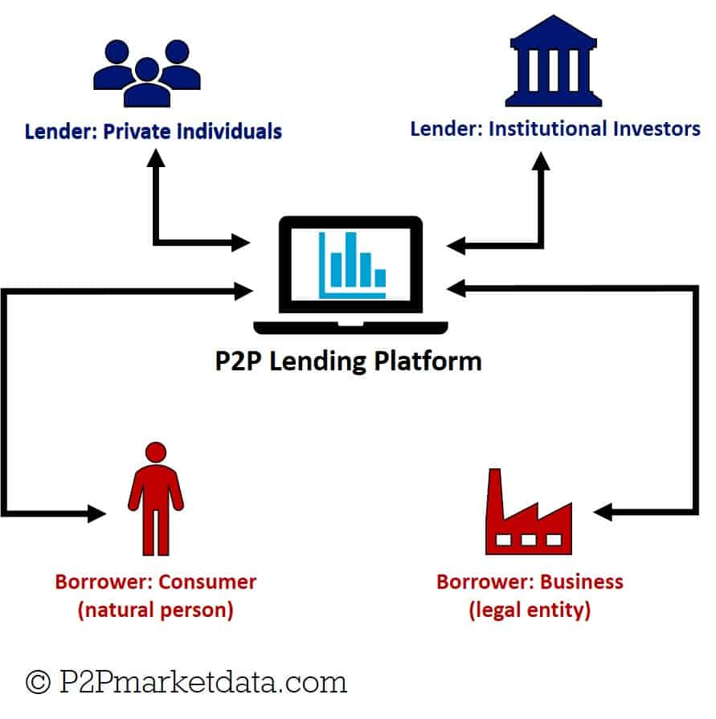

```{r setup, include=FALSE}
# We want the results to be hidden by default, though for some chunks we will override this to show the results
knitr::opts_chunk$set(warning = F, results = "hide", message = F)
```

```{r include=FALSE}
library(ezids) # We will use functions form this package to get nicer looking results
library(tidyverse) # We need this package for data manipulation, piping, and graphing
library(corrplot) # We will need this package to plot the correlation matrix
library(scales) # This package will help us when labeling the scatter plots
library(knitr) # For features in RMarkdown
library(kableExtra) # For better kable tables
library(rpart) # For the classification tree model
library(caret) # For the classification tree model
set.seed(1) # For the classification tree model
library(rpart.plot) # For plotting nice looking classification trees
library(pROC) # For ROC/AUC
library(car) # for the logistic regression
library(mlbench) # for the logistic regression
library(regclass) # for the logistic regression
library(ResourceSelection) # use the hoslem.test() for logit model evaluation
library(pscl) # The pR2() function calculates McFadden statistics for logit model evaluaiton
library(broom) # For tidying models
library(glmnet) # Library containing Lasso Regression operator
library(vip) # For lasso regression

# Read in the data from the working directory
loans <- read_csv("loan_data.csv")
#loans
```


# Introduction

Peer-to-peer (P2P) lending was a phenomenon less than ten years ago, exploding in popularity by offering a break from traditional banking. Individuals flocked to these alternative credit markets to finance their small business ventures, home purchases, and to consolidate debt. Although direct P2P lending has undergone changes over recent years, it remains a viable option for borrowers and investors.

The global P2P lending market is anticipated to grow from \$84 billion in 2021 to \$706 billion by 2030, according to figures from Precedence Research.^[“Peer to Peer (P2P) Lending Market Size, Report 2022-2030.” Peer to Peer (P2P) Lending Market Size, Report 2022-2030, www.precedenceresearch.com/peer-to-peer-lending-market. Accessed 4 Nov. 2022.] This analysis takes a closer look at the mechanics of P2P lending to gain a better understanding of what considerations are factored into decisions to apply for, issue, and provide financing via P2P platforms. Analysis and statistical testing identifies credit underwriting policy and borrowers’ failure to fully pay as variables of interest that should be considered in future in-depth analyses.  

## What is P2P Lending?
P2P lending is the provision of financing without a traditional bank as the source of funds; it is, like it sounds, peers lending money to their peers. Instead of banks, online lending platforms provide a service that connects willing lenders, or investors, with individuals seeking to borrow funds. Historically, these investors have been predominantly private individuals seeking alternate forms of investments, wherein they receive the interest earned on the money they loan out.

 

Borrowers, on the other hand, are connected to feasible funding that they might not have otherwise been able to attain. Many borrowers participating in P2P lending did or would have experienced difficulties qualifying for traditional loans from banks. This perception of higher risk among the lenders can often translate into higher interest rates. P2P platforms screen borrowers and set rates and terms but it is ultimately up to the lender whether they will provide the funds. 


## Introducing LendingClub
The P2P market was dominated by LendingClub during the early rise of P2P lending, and it remains a leader in the industry. It makes money by charging borrowers an origination fee, charging investors a service fee, and selling loans in secondary markets. LendingClub’s typical annual percentage rate (APR) is between 5.99% and 35.89% while the origination fee of 1% to 6% is taken off the top of loans. Borrowers on LendingClub typically have good-to-excellent credit (700 or higher credit score) and a low debt-to-income ratio. 
 
 


## Our Data
Our dataset contains over 9,500 observations of loan data from LendingClub from between 2007 and 2015. We obtained the dataset from Kaggle here: https://www.kaggle.com/datasets/urstrulyvikas/lending-club-loan-data-analysis

Our work is stored on our team GitHub here: https://github.com/jschild01/JMB_DATS_6101

Below are the variables in the dataset and their accompanying definitions as supplied by Kaggle:

```{r results = "show", echo=FALSE}
# This is copied form the Kaggle site
# We will use a kable table for simplicity
data_definitions <- data.frame(Variable = c("credit.policy", "purpose", "int.rate", "installment", "log.annual.inc", "dti", "fico", "days.with.cr.line", "revol.bal", "revol.util", "inq.last.6mths", "delinq.2yrs", "pub.rec", "not.fully.paid"),
                          Definition = c("1 if the customer meets the credit underwriting criteria of LendingClub.com, and 0 otherwise.",
                                         "The purpose of the loan (takes values creditcard, debtconsolidation, educational, majorpurchase, smallbusiness, and all_other).",
                                         "The interest rate of the loan, as a proportion (a rate of 11% would be stored as 0.11). Borrowers judged by LendingClub.com to be more risky are assigned higher interest rates.",
                                         "The monthly installments owed by the borrower if the loan is funded.",
                                         "The natural log of the self-reported annual income of the borrower.",
                                         "The debt-to-income ratio of the borrower (amount of debt divided by annual income).",
                                         "The FICO credit score of the borrower.",
                                         "The number of days the borrower has had a credit line.",
                                         "The borrower's revolving balance (amount unpaid at the end of the credit card billing cycle).",
                                         "The borrower's revolving line utilization rate (the amount of the credit line used relative to total credit available).",
                                         "The borrower's number of inquiries by creditors in the last 6 months.",
                                         "The number of times the borrower had been 30+ days past due on a payment in the past 2 years.",
                                         "The borrower's number of derogatory public records (bankruptcy filings, tax liens, or judgments).",
                                         "Whether the borrower will be fully paid or not."))

kable(data_definitions) %>%
  kable_styling(bootstrap_options = c("striped", "condensed"))
```


## SMART Question
Our analysis will explore things such as income-to-debt ratios, credit score, interest rates, and delinquencies among direct P2P borrowers in an attempt to understand the risks and opportunities associated with P2P lending. Specifically, we intend to examine the impact that these variables have on who received loans and who defaulted on their loans between 2007 and 2015. 

We will seek to answer the following questions:  

1.	What variable or variables, if any, have an impact on if the person meets the credit underwriting criteria?  
2.	What variable or variables, if any, have an impact on if the person fully repays the loan?  
3.	Do borrowers who meet the credit underwriting criteria have a lower chance of not fully repaying the loan? If so, how big is the difference?


# EDA Review and Follow-up

Our exploratory data analysis followed the below 9-step checklist presented in Chapter 4 of *The Art of Data Science*.^[Peng, R. D., & Matsui, E. (2016). The Art of Data Science: A Guide for anyone who works with data. Skybrude consulting LLC.] 

1. Formulate our question  
2. Read in our data  
3. Check the packaging  
4. Look at the top and the bottom of your data  
5. Check your "n"s  
6. Validate with at least one external data source  
7. Make a plot  
8. Try the easy solution first  
9. Follow up


In summary, our EDA found:

1. The credit underwriting criteria of LendingClub is proven to be effective as borrowers who do not meet the credit underwriting criteria are more than twice as likely to default in comparison to borrowers who do meet the criteria.  
2. There are some proven relationships between `credit.policy` and other numeric variables such as `int.rate`, `fico`, and `inq.last.6mths`. Additionally, there was no clearly established relationships between `not.fully.paid` and other numeric variables (except for `credit.policy`).  
3. There are statistically significant relationships between the categorical and logical variables `purpose`, `credit.policy`, and `not.fully.paid`.  
4. For all numeric variables except for `delinq.2yrs`, their mean significantly varies for different categories of`purpose`.


Before we get into making models, there is some work we would like to do with the dataset first.

## Converting Variables
From our EDA we know that the `credit.policy` and `not.fully.paid` variables function as logicals, and the `purpose` variable functions as a factor with 7 levels. We will start by formally converting these variables from numerical data-types in R to logical and the factor data-types, respectively.

```{r}
# We determined this makes sense to do from our EDA
loans$credit.policy <- as.logical(loans$credit.policy)
loans$not.fully.paid <- as.logical(loans$not.fully.paid)

loans$purpose <- as.factor(loans$purpose)
```

Of the `r ncol(loans)` variables in the original dataset, 11 are numeric, 2 are logical, and 1 is a factor.


## Adding Additional Logicals
From our EDA we saw that the overwhelming majority of loans had a value of 0 for `delinq.2yrs` and `pub.rec`. The variables might be more useful in terms of having stronger correlations and a larger impact in models if we create logical versions of these variables. We will introduce `has.delinq.2yrs` and `has.pub.rec` based on whether or not the value is 0 or greater than 0.

```{r}
# It might help to turn these variables into logicals since most are 0
loans <- loans %>%
  mutate(has.delinq.2yrs = delinq.2yrs > 0,
         has.pub.rec = pub.rec > 0)
```


## Revolving Balance Transformation
From our EDA we saw that the `revol.bal` variable had a wide range of values as well as outlier issues. We wondered if it would work better if we took the natural log of it, similar to how the income provided in the dataset (the `log.annual.inc` variable) is in the form of the natural log. However, some values for `revol.bal` are 0, and taking the natural log of that results in -Inf. One way to deal with this without removing those values is to add 1 to all of the values for `revol.bal` before taking the natural log. 

Given the range of these values (the IQR is `r IQR(loans$revol.bal)`) adding one should have a negligible effect, and adding one to all values keeps the data consistent. In case it is significant that the `revol.bal` is 0 we will add a logical variable `has.revol.bal` based on whether the value of `revol.bal` is 0 or greater than 0.

```{r}
# Some loans have a revol.bal value of 0, the natural log of which is -Inf
# Adding 1 to all values before taking the natural log resolves this issue by nudging the value a very small amount
# In case it was meaningful if the loan had a revol.bal value of 0 versus >0, we can add a logical to account for that
loans <- loans %>%
  mutate(log.revol.bal = log(revol.bal+1),
         has.revol.bal = revol.bal > 0)
```


## Utility of the new variables
Now that we have added some new variables, it would be helpful to look at a correlation plot and make some comparisons to assess whether they would be more useful going forward than their original forms.

```{r fig.width=8, fig.height=8}
# A new correlation matrix with the new and transformed variables
# For our correlation matrix we want to include everything but the purpose variable
# We can put the new variables together at the top
loans_correlation_matrix_new <- loans %>%
  select(-purpose) %>%
  select(revol.bal, log.revol.bal, has.revol.bal, has.delinq.2yrs, has.pub.rec, everything()) %>%
  cor()

# The mixed correlation plot makes a nice visualization
corrplot.mixed(loans_correlation_matrix_new, tl.pos = "lt")
```

Some notable observations of this:  
1. `has.delinq.2yrs` doesn't have any strong correlations, and the 2 potentially useful ones (`int.rate` and `fico`) are almost exactly the same as `delinq.2yrs`.  
2. Similarly, `has.pub.rec` doesn't have any strong correlations, and the 2 potentially useful ones (`int.rate` and `fico`) are   the same as `pub.rec`.  
3. `log.revol.bal` has a stronger correlation with `dti` and a much stronger correlation with `revol.util` compared to `revol.bal`.   
4. `log.revol.bal` has a weaker correlation with `credit.policy` compared to `revol.bal`.  
5. `has.revol.bal` does not have a significant correlation with anything (`log.revol.bal` excepted) except `revol.util`, where the correlation is weaker than that of `log.revol.bal`.

From this we can conclude that converting `delinq.2yrs` and `pub.rec` to logicals did not add any advantage for our dataset. We can also conclude that the `has.revol.bal` variable is not necessary and will not add value to our analysis beyond what `log.revol.bal` already covers. Successfully eliminating these as possibilities increases our confidence in the use of their original structures.

Lastly, we see that taking the natural log of `revol.bal` might be useful, as `log.revol.bal` has some stronger correlations than `revol.bal`. We will note this as we proceed with our modeling. 


## Updated Visuals

Now that we have our final dataset, let's rerun some of the EDA graphs before we move onto modeling. These are updated histograms, boxplots, Q-Q plots, and barplots with the added variables.


### Histograms
```{r fig.width=8, echo=FALSE}
# By gathering the variables we want to see into a long format with the gather() function, we can then create a histogram
# for each variable using the facet_wrap() function in ggplot2.
loans %>%
  select(int.rate, installment, log.annual.inc, dti, fico, days.with.cr.line, revol.bal, revol.util,
           inq.last.6mths, delinq.2yrs, pub.rec, log.revol.bal) %>%
  gather(variable, value) %>%
  ggplot(aes(x = value)) +
  geom_histogram(fill = "steelblue", color = "black") +
  facet_wrap(~ variable, scales = "free") + # Free scales so the graphs are readable
  labs(title = "Histograms of Numeric Variables", x = "Value", y = "Count") +
  theme_minimal()
```

### Boxplots
```{r fig.width=8, echo=FALSE}
# By gathering the variables we want to see into a long format with the gather() function, we can then create a boxplot
# for each variable using the facet_wrap() function in ggplot2.
loans %>%
  select(int.rate, installment, log.annual.inc, dti, fico, days.with.cr.line, revol.bal, revol.util,
           inq.last.6mths, delinq.2yrs, pub.rec, log.revol.bal) %>%
  gather(variable, value) %>%
  ggplot(aes(x = value)) +
  geom_boxplot(fill = "steelblue", color = "black",
               outlier.size = 2, outlier.alpha = 0.2) + # Translucent and larger outliers to help with overplotting
  facet_wrap(~ variable, scales = "free") + # Free scales so the graphs are readable
  labs(title = "Boxplots of Numeric Variables", x = "Value") +
  theme_minimal() +
  theme(axis.text.y = element_blank(), axis.ticks.y = element_blank())
```

### Q-Q Plots
```{r echo=FALSE}
# By gathering the variables we want to see into a long format with the gather() function, we can then create a Q-Q plot
# for each variable using the facet_wrap() function in ggplot2.
loans %>%
  select(int.rate, installment, log.annual.inc, dti, fico, days.with.cr.line, revol.bal, revol.util,
           inq.last.6mths, delinq.2yrs, pub.rec, log.revol.bal) %>%
  gather(variable, value) %>%
  ggplot(aes(sample = value)) +
  geom_qq(color = "steelblue") +
  geom_qq_line() +
  facet_wrap(~ variable, scales = "free") + # Free scales so the graphs are readable
  labs(title = "Q-Q Plots of Numeric Variables", x = "Theoretical", y = "Sample") +
  theme_minimal()
```

### Bar Plots
```{r fig.width=8, echo=FALSE}
# By gathering the variables we want to see into a long format with the gather() function, we can then create a bar graph
# for each variable using the facet_wrap() function in ggplot2.
loans %>%
  select(credit.policy, purpose, not.fully.paid, has.revol.bal, has.delinq.2yrs, has.pub.rec) %>%
  gather(variable, value) %>%
  ggplot(aes(x = value)) +
  geom_bar(fill = "steelblue", color = "black") +
  facet_wrap(~ variable, scales = "free") + # Free scales so the graphs are readable
  coord_flip() +
  labs(title = "Bar Charts of Non-Numeric Variables", x = "Value", y = "Count") +
  theme_minimal() +
  theme()
```


# Choosing Our Models

To better understand our data and attempt to answer our SMART questions, we decided to use the following models:

* 5 Simple Linear Regressions
* 3 Multiple Regressions
* 1 LASSO Regression  
* 2 Logistic Regressions
* 2 Classification Trees


# Simple Linear Regression

From the correlation plot we see 5 combinations of variables with notable correlations (greater than 0.4 or less than -0.4) that we would like to explore further by trying to model them with simple linear regressions.


## Interest Rate vs FICO Score

```{r}
# fit linear model
linear_model_1 <- lm(int.rate ~ fico, data=loans)
  
# view summary of linear model
summary(linear_model_1)

# scatterplot with regression line and confidence interval
scatterplot(int.rate ~ fico, data = loans)

#loans %>%
#  ggplot(aes(x = fico, y = int.rate)) +
#  geom_point(color = "steelblue", alpha = 0.2) +
#  geom_smooth(method = "lm", se = T) +
#  labs(title = "Interest Rate vs FICO Score",
#       x = "FICO Score", y = "Interest Rate") +
#  scale_x_continuous(limits = c(600, NA), expand = expansion(mult = c(0, .05))) +
#  scale_y_continuous(labels = label_percent(), limits = c(.05, NA), expand = expansion(mult = c(0, .05))) +
#  theme_minimal()
```


## Revolving Utilization Rate vs Interest Rate

```{r}
# fit linear model
linear_model_2 <- lm(revol.util ~ int.rate, data=loans)
  
# view summary of linear model
summary(linear_model_2)

# scatterplot with regression line and confidence interval
scatterplot(revol.util ~ int.rate, data = loans)

#loans %>%
#  ggplot(aes(x = int.rate, y = revol.util)) +
#  geom_point(color = "steelblue", alpha = 0.2) +
#  geom_smooth(method = "lm") +
#  labs(title = "Revolving Line Utilization Rate vs Interest Rate",
#       x = "Interest Rate", y = "Revolving Line Utilization Rate") +
#  scale_x_continuous(labels = label_percent(), limits = c(.05, NA), expand = expansion(mult = c(0, .05))) +
#  scale_y_continuous(labels = label_percent(scale = 1)) +
#  theme_minimal()
```


## Installment vs Natural Log of Annual Income

```{r}
# fit linear model
linear_model_3 <- lm(installment ~ log.annual.inc, data=loans)
  
# view summary of linear model
summary(linear_model_3)

# scatterplot with regression line and confidence interval
scatterplot(installment ~ log.annual.inc, data = loans)

#loans %>%
#  ggplot(aes(x = log.annual.inc, y = installment)) +
#  geom_point(color = "steelblue", alpha = 0.2) +
#  geom_smooth(method = "lm") +
#  labs(title = "Installment vs Log of Annual Income",
#       x = "Log of Annual Income", y = "Installment") +
#  theme_minimal()
```


## Revolving Utilization Rate vs FICO Score

```{r}
# fit linear model
linear_model_4 <- lm(revol.util ~ fico, data=loans)
  
# view summary of linear model
summary(linear_model_4)

# scatterplot with regression line and confidence interval
scatterplot(revol.util ~ fico, data = loans)

#loans %>%
#  ggplot(aes(x = fico, y = revol.util)) +
#  geom_point(color = "steelblue", alpha = 0.2) +
#  geom_smooth(method = "lm") +
#  labs(title = "Revolving Line Utilization Rate vs FICO Score",
#       x = "FICO Score", y = "Revolving Line Utilization Rate") +
#  scale_x_continuous(limits = c(600, NA), expand = expansion(mult = c(0, .05))) +
#  scale_y_continuous(labels = label_percent(scale = 1)) +
#  theme_minimal()
```


## Revolving Utilization Rate vs Natural Log of Revolving Balance

```{r}
# fit linear model
linear_model_5 <- lm(revol.util ~ log.revol.bal, data=loans)
  
# view summary of linear model
summary(linear_model_5)

# scatterplot with regression line and confidence interval
scatterplot(revol.util ~ log.revol.bal, data = loans)

#loans %>%
#  ggplot(aes(x = fico, y = revol.util)) +
#  geom_point(color = "steelblue", alpha = 0.2) +
#  geom_smooth(method = "lm") +
#  labs(title = "Revolving Line Utilization Rate vs FICO Score",
#       x = "FICO Score", y = "Revolving Line Utilization Rate") +
#  scale_x_continuous(limits = c(600, NA), expand = expansion(mult = c(0, .05))) +
#  scale_y_continuous(labels = label_percent(scale = 1)) +
#  theme_minimal()
```


## Evaluation of Models

1. The first one is interest rate vs FICO score. We can see from the graph that the relation is almost linear as the linear regression line lies close to the true regression line. This is further confirmed by the adjusted r^2 value that is relatively significant at 51% and the p value at least than 0.05.

2. The second one is revolving utilization rate vs interest rate. We can see from the graph that the relation is not as linear as the linear regression line lies tangent to the true regression line. This is further confirmed by the adjusted r^2 value that is relatively low at 21% and the p value at least than 0.05.

3. The third one is installment vs natural log of annual income. We can see from the graph that the relation is not as linear as the linear regression line lies tangent to the true regression line but converges as both variables increase. This is further confirmed by the adjusted r^2 value that is relatively low at 20% and the p value at least than 0.05.

4. The fourth one is revolving utilization rate vs FICO score. We can see from the graph that the relation is not as linear as the linear regression line lies relatively loser to the true regression line in comparison to the previous two cases. This is further confirmed by the adjusted r^2 value that is relatively low at 29% and the p value at least than 0.05.

5. The fifth one is revolving utilization rate vs natural log of revolving balance. We can see that the true regression is far from linear the adjusted r^2 is relatively low at 24.85%. 

Overall we can conclude that simple linear regression is not an effective way to model these relationships, though the first model isn't too bad.


# Multiple Linear Regression for Interest Rate

Since we know that interest rate is higher for riskier loans we wanted to test that by building a model to predict interest rate.

## Feature Selection

```{r}
set.seed(7)
loans_mlr_int <- loans

# prepare training scheme
control <- trainControl(method="repeatedcv", number=10, repeats=3)

# train the model
mlr_int_training <- train(int.rate~., data=loans_mlr_int, method="lm", preProcess="scale", trControl=control)

# estimate variable importance
mlr_int_importance <- varImp(mlr_int_training, scale=FALSE)

# summarize importance
print(mlr_int_importance)

# plot importance
plot(mlr_int_importance)
```


## Multiple Linear Regression Model

```{r}
mlr_int_model <- lm(int.rate ~ fico+installment+purpose+dti+inq.last.6mths+credit.policy+log.annual.inc, data = loans_mlr_int)
summary(mlr_int_model)
```

```{r}
mlr_int_model$coefficients
mlr_int_model$call
```

```{r results='markup'}
coef(mlr_int_model)
confint(mlr_int_model)
```

```{r}
mlr_int_model_tidy <- tidy(mlr_int_model)
mlr_int_model_tidy

mlr_int_model_summary <- augment(mlr_int_model)
str(mlr_int_model_summary)
head(mlr_int_model_summary)
```

```{r}
par(mfrow=c(2,2))
plot(mlr_int_model)
```

```{r}
vif(mlr_int_model)
```

```{r}
lmtest::bptest(mlr_int_model)
```

```{r}
ncvTest(mlr_int_model)
```

```{r}
distBCMod <- BoxCoxTrans(loans_mlr_int$int.rate)
print(distBCMod)
```

```{r}
loans_mlr_int <- cbind(loans_mlr_int, dist_new=predict(distBCMod, loans_mlr_int$int.rate)) 
head(loans_mlr_int)
```

```{r}
mlr_int_model_2 <- lm(dist_new ~ fico+installment+purpose+revol.util+log.revol.bal+credit.policy+log.annual.inc, data=loans_mlr_int)
summary(mlr_int_model_2)
lmtest::bptest(mlr_int_model_2)
```

```{r}
par(mfrow=c(2,2))
plot(mlr_int_model_2)
```

Note here the first linear model built with the features with the highest importance has no multicolinearity but has high heteroscedasticity. In order to remove that we performed a box cox transformation. That reduced the heteroscedasticity but did not solve the problem So, I used the sandwich library and that helped. The resulting model is homoscedastic and explains 67%. 


# LASSO Regression

We decided to try LASSO regression as lasso performs better in the presence of outliers and avoids overfitting, and eliminates less important features thereby helping in interpreting the model better.

```{r results="show"}
loans_lasso <- loans

# glmnet library can't handle factor variable so the variables have to be converted to dummy variables
loans_lasso$credit.policy.T <- ifelse(loans_lasso$credit.policy == TRUE, 1, 0)
loans_lasso$credit.policy.F <- ifelse(loans_lasso$credit.policy == FALSE, 1, 0)
loans_lasso$has.delinq.2yrs.T <- ifelse(loans_lasso$has.delinq.2yrs == TRUE, 1, 0)
loans_lasso$has.delinq.2yrs.F <- ifelse(loans_lasso$has.delinq.2yrs == FALSE, 1, 0)
loans_lasso$has.revol.bal.T <- ifelse(loans_lasso$has.revol.bal == TRUE, 1, 0)
loans_lasso$has.revol.bal.F <- ifelse(loans_lasso$has.revol.bal == FALSE, 1, 0)
loans_lasso$has.pub.rec.T <- ifelse(loans_lasso$has.pub.rec == TRUE, 1, 0)
loans_lasso$has.pub.rec.F <- ifelse(loans_lasso$has.pub.rec == FALSE, 1, 0)
loans_lasso$has.revol.bal.T <- ifelse(loans_lasso$has.revol.bal == TRUE, 1, 0)
loans_lasso$has.revol.bal.F <- ifelse(loans_lasso$has.revol.bal == FALSE, 1, 0)
loans_lasso$not.fully.paid.T<- ifelse(loans_lasso$not.fully.paid == TRUE, 1, 0)
loans_lasso$not.fully.paid.F<- ifelse(loans_lasso$not.fully.paid == FALSE, 1, 0)

# The below dataframe shows the structure of the data, in which the categorical variables are converted to dummy variables.
str(loans_lasso)
```


The original categorical variables were dropped by keeping the dummy variables and using it for training and testing.
The predictor dataframe included all the variables except the interest rate, as interest rate is the response.

```{r results='markup'}
# Extracting the values of Y
lasso_y <- loans_lasso$int.rate 

# Extracting the values of X
# lasso_x <- loans_lasso %>%
#   select(purpose,int.rate,credit.policy,not.fully.paid,has.delinq.2yrs,has.pub.rec,has.revol.bal,log.revol.bal,X,revol.util)

lasso_x <- subset(loans_lasso, select = -c(purpose,int.rate,credit.policy,not.fully.paid,has.delinq.2yrs,has.pub.rec,has.revol.bal,log.revol.bal,revol.util))

str(lasso_x)
```


The entire data regressor and response data was split in to 70% and 30% for training and testing purpose.

```{r results='markup'}
# Partition and create the index matrix of selected values
lasso_index <- createDataPartition(loans_lasso$int.rate, p=0.7, list=FALSE, times=1)

# Creating Test and Training Data in the ratio of 70% and 30%
lasso_train_x <- as.matrix(lasso_x[lasso_index,])
lasso_test_x <- as.matrix(lasso_x[-lasso_index,])
#train_datx=(lasso_x[index,])
lasso_train_y <- as.matrix(lasso_y[lasso_index])
#test_datx=as.data.frame(lasso_x[-index,])
lasso_test_y <- as.matrix(lasso_y[-lasso_index])
```


To run the LASSO Regression the library glmnet was used and the solver cv.glmnet was used.

```{r results='markup'}
# Fitting Lasso 
lasso_alpha1_fit <- cv.glmnet(lasso_train_x, lasso_train_y, alpha=1, type.measure = 'mse', family='gaussian')
```


The `cv.glmnet()` function performs the 10 fold cross validation on our training data and picks the best lambda value based on least mean square cross validation error criteria.
For our case, the lambda is `r lasso_alpha1_fit$lambda.min`.

```{r results='markup'}
# Best Lambda
lasso_best_lambda <- lasso_alpha1_fit$lambda.min
lasso_best_lambda
```


The below shows the shrunk coefficients obtained from the model. The unimportant coefficients go to zero. The dots next to the coefficient names represent the shrinkage of the unimportant variables to zero.

```{r results='markup'}
# Coefficients
coef(lasso_alpha1_fit)
```


The obtained model is used to predict the interest rate using the reserved 30% testing data and the Mean Squared Error (MSE) & R-squared value are tabulated below.

```{r results='markup'}
# Using the model to predict the interest rate using the test data
lasso_y_predicted <- predict(lasso_alpha1_fit, s = lasso_best_lambda, newx = lasso_test_x)
```


The MSE:

```{r results='markup'}
# Calculating the mean squared errors
lasso_mse <- mean((lasso_y_predicted - lasso_test_y)^2)
lasso_mse
```


The R-squared value

```{r results='markup'}
# R squared
# Calculating the total sum of squares(sst)
lasso_sst <- sum((lasso_test_y - mean(lasso_test_y))^2)
# Calculating the sum of squared errors (sse)
lasso_sse <- sum((lasso_y_predicted - lasso_test_y)^2)
lasso_rsq <- 1-(lasso_sse/lasso_sst)
lasso_rsq
```


The below graph shows the Importance of variables to predict the interest rates. To interpret in common language, these predictors play major role in deciding the interest rates for the customers.

```{r}
# Plotting the variable importance graph
vip(lasso_alpha1_fit)
```


It is clear from the graph that the interest rates are decided based on compliance with the credit policy and credit score (fico).


# Logistic Regression for Credit Policy

## Effects on Credit Policy by Purpose

To study the effects on `credit.policy` by the factor `purpose` (`credit.policy` and `purpose` are both categorical variables), we can create two-way contingency table of the outcome and predictors, and make sure there are no cells of zero frequencies.

```{r results="show"}
credit_policy_purpose_table <-  xtabs(~ credit.policy + purpose, data = loans)

credit_policy_purpose_table %>%
  kable() %>%
  kable_styling(bootstrap_options = c("striped", "condensed"), full_width = FALSE)
```


## Feature Selection

```{r results="show"}
set.seed(7)
loans_logit_credit <- loans

loans_logit_credit$credit.policy = as.factor(loans_logit_credit$credit.policy)

# prepare training scheme
control <- trainControl(method="repeatedcv", number=10, repeats=3)

# train the model
logit_credit_training <- train(credit.policy~., data=loans_logit_credit, method="glm", preProcess="scale", trControl=control)

# estimate variable importance
logit_credit_importance <- varImp(logit_credit_training, scale=FALSE)

# summarize importance
print(logit_credit_importance)

# plot importance
plot(logit_credit_importance)
```


## Logistic Regression Model

```{r}
logit_credit_model <- glm(credit.policy ~ inq.last.6mths+fico+log.annual.inc+dti+delinq.2yrs+pub.rec+purpose, data = loans_logit_credit, binomial(link = "logit") )  
```

We can see the summary of the logit model here:

```{r results='markup'}
summary(logit_credit_model)

# nicer table for the model summary
xkabledply(logit_credit_model, title = "Logistic Regression :")
```

Before moving on, let us look at the model object `logit_credit_model` a little deeper. The fitted values can be found from `logit_credit_model$fitted.values`. And the first fitted value is `r logit_credit_model$fitted.values[1]`. This is the probability of  credit.policyted for data point #1. Compare to the value from `predict(logit_credit_model)` to be `r predict(logit_credit_model)[1]`. 

The `predict()` function gives us the logit value. You can exponentiate to get the odds ratio p/q as `r exp(predict(logit_credit_model)[1])`. And finally, we can find p from p/q, and indeed it is confirmed to be `r 1/(1+exp(-predict(logit_credit_model)[1]))`.

The easier way to get that is simply use `predict(logit_credit_model, type = c("response"))[1]` = `r predict(logit_credit_model, type = "response" )[1]`. The `predict()` function will also allow you to find model prediction with unseen/untrained data points where `fitted.values` do not give.

```{r}
logit_credit_p_fitted <- logit_credit_model$fitted.values[1] # this is the model predicated value p-hat for the first data row (not the actual data point p)  
```

This is stored in the model as the fitted value for the probability `p` of the first data point. Since the actual data point is a 0/1 True/False value, it is not easy to directly compare them unless we use a cutoff value (default as 0.5) to convert the probability `p` to 0/1.

Now, for unseen data point, we can use the `predict()` function to find the model predicted values. But be careful of what you are getting with the `predict()` function in classification models. Let us compare the three options below. For easy comparison, let us use the same data point in the dataset as an example.

```{r}
# This gives you the predicted values of the data points inside the model.
predict(logit_credit_model)  # the is from the model, which gives you the value for logit(p) or ln(p/q) 
```


### Confidence Intervals

We can easily determine the confidence intervals of each coefficient with these two slightly different ways:

```{r results="markup"}
## CIs using profiled log-likelihood
# confint(logit_credit_model)
xkabledply(confint(logit_credit_model), title = "CIs using profiled log-likelihood")

## CIs using standard errors
# confint.default(logit_credit_model)
xkabledply(confint.default(logit_credit_model), title = "CIs using standard errors")
```


## Model evaluation

### Confusion matrix

```{r results='markup'}
xkabledply(confusion_matrix(logit_credit_model), title = "Confusion matrix from Logit Model" )
```


### ROC and AUC

Receiver-Operator-Characteristic (ROC) curve and Area-Under-Curve (AUC) measures the true positive rate (or sensitivity) against the false positive rate (or specificity). The area-under-curve is always between 0.5 and 1. Values higher than 0.8 is considered good model fit.

```{r}
# receiver operating characteristic curve, gives the diagnostic ability of a binary classifier system as its discrimination threshold is varied. The curve is on sensitivity/recall/true-positive-rate vs false_alarm/false-positive-rate/fall-out.
loans_logit_credit$prediction <- predict(logit_credit_model, type = "response" )

roc_logit_credit <- roc(credit.policy ~ prediction, data=loans_logit_credit)
auc(roc_logit_credit) # area-under-curve prefer 0.8 or higher.

# visualize the curve
plot(roc_logit_credit)
```

We have here the area-under-curve of `r auc(roc_logit_credit)`, which is more than 0.8. This test also agrees with the Hosmer and Lemeshow test that the model is considered a good fit.


### McFadden

McFadden is another evaluation tool we can use on logit regressions. This is part of what is called pseudo-R-squared values for evaluation tests. We can calculate the value directly from its definition if we so choose to.

```{r results="show"}
logit_credit_null <- glm(credit.policy ~ 1, data = loans_logit_credit, family = "binomial")
mcFadden = 1 - logLik(logit_credit_model)/logLik(logit_credit_null)
mcFadden
```

Or we can use other libraries. The `pscl` (Political Science Computational Lab) library has the function `pR2()` (pseudo-$R^2$) which will do the trick.

```{r results="show"}
logit_credit_pr2 = pR2(logit_credit_model)
logit_credit_pr2
```

With the McFadden value of `r logit_credit_pr2['McFadden']`, which is analogous to the coefficient of determination $R^2$, only about 42% of the variation in y is explained by the explanatory variables in the model.


### Hosmer and Lemeshow Test

The Hosmer and Lemeshow Goodness of Fit test can be used to evaluate logistic regression fit.

```{r results="markup"}
logit_credit_hoslem <- hoslem.test(loans_logit_credit$credit.policy, fitted(logit_credit_model)) # Hosmer and Lemeshow test, a chi-squared test

logit_credit_hoslem
# Have not found a good way to display it.
```

The p-value is `r logit_credit_hoslem$p.value` which indicates indicates the model is a good fit.


# Logistic Regression for Not Fully Paid

## Effects on Not Fully Paind by Purpose

To study the effects on `not.fully.paid` by the factor `purpose` (`not.fully.paid` and `purpose` are both categorical variables), we can create two-way contingency table of the outcome and predictors, and make sure there are no cells of zero frequencies.

```{r results="show"}
nfp_purpose_table = xtabs(~ not.fully.paid + purpose, data = loans)

nfp_purpose_table %>%
  kable() %>%
  kable_styling(bootstrap_options = c("striped", "condensed"), full_width = FALSE)
```


## Feature Selection

```{r}
set.seed(7)
loans_logit_nfp <- loans

loans_logit_nfp$not.fully.paid = as.factor(loans_logit_nfp$not.fully.paid)

# prepare training scheme
control <- trainControl(method="repeatedcv", number=10, repeats=3)

# train the model
logit_nfp_training <- train(not.fully.paid~., data=loans_logit_nfp, method="glm", preProcess="scale", trControl=control)

# estimate variable importance
logit_nfp_importance <- varImp(logit_nfp_training, scale=FALSE)

# summarize importance
print(logit_nfp_importance)

# plot importance
plot(logit_nfp_importance)
```


## Logistic Regression Model

```{r}
logit_nfp_model <- glm(not.fully.paid ~., data = loans_logit_nfp, binomial(link = "logit") )  
```

We can see the summary of the logit model here:

```{r results='markup'}
summary(logit_nfp_model)

# nicer table for the model summary
xkabledply(logit_nfp_model, title = "Logistic Regression :")
```

Before moving on, let us look at the model object `logit_nfp_model` a little deeper. The fitted values can be found from `logit_nfp_model$fitted.values`. And the first fitted value is `r logit_nfp_model$fitted.values[1]`. This is the probability of being not.fully.paid for data point #1. Compare to the value from `predict(logit_nfp_model)` to be `r predict(logit_nfp_model)[1]`. 

The `predict()` function gives us the logit value. You can exponentiate to get the odds ratio p/q as `r exp(predict(logit_nfp_model)[1])`. And finally, we can find p from p/q, and indeed it is confirmed to be `r 1/(1+exp(-predict(logit_nfp_model)[1]))`.

The easier way to get that is simply use `predict(logit_nfp_model, type = c("response"))[1]` = `r predict(logit_nfp_model, type = "response" )[1]`. The `predict()` function will also allow you to find model prediction with unseen/untrained data points where `fitted.values` do not give.

```{r}
logit_nfp_p_fitted <- logit_nfp_model$fitted.values[1] # this is the model predicated value p-hat for the first data row (not the actual data point p)  
logit_nfp_p_fitted
```

This is stored in the model as the fitted value for the probability `p` of the first data point. Since the actual data point is a 0/1 True/False value, it is not easy to directly compare them unless we use a cutoff value (default as 0.5) to convert the probability `p` to 0/1.

Now, for unseen data point, we can use the `predict( )` function to find the model predicted values. But be careful of what you are getting with the `predict()` function in classification models. Let us compare the three options below. For easy comparison, let us use the same data point in the dataset as an example.

```{r}
# This gives you the predicted values of the data points inside the model.
predict(logit_nfp_model)  # the is from the model, which gives you the value for logit(p) or ln(p/q) 
```


### Confidence Intervals

We can easily determine the confidence intervals of each coefficient with these two slightly different ways:

```{r results="markup"}
## CIs using profiled log-likelihood
# confint(logit_nfp_model)
xkabledply(confint(logit_nfp_model), title = "CIs using profiled log-likelihood")

## CIs using standard errors
# confint.default(logit_nfp_model)
xkabledply(confint.default(logit_nfp_model), title = "CIs using standard errors")
```


## Model evaluation

### Confusion matrix

```{r results='markup'}
xkabledply(confusion_matrix(logit_nfp_model), title = "Confusion matrix from Logit Model" )
```


### ROC and AUC

Receiver-Operator-Characteristic (ROC) curve and Area-Under-Curve (AUC) measures the true positive rate (or sensitivity) against the false positive rate (or specificity). The area-under-curve is always between 0.5 and 1. Values higher than 0.8 is considered good model fit.

```{r}
# receiver operating characteristic curve, gives the diagnostic ability of a binary classifier system as its discrimination threshold is varied. The curve is on sensitivity/recall/true-positive-rate vs false_alarm/false-positive-rate/fall-out.
loans_logit_nfp$prediction <- predict(logit_nfp_model, type = "response" )

roc_logit_nfp <- roc(not.fully.paid ~ prediction, data=loans_logit_nfp)
auc(roc_logit_nfp) # area-under-curve prefer 0.8 or higher.

# visualize the curve
plot(roc_logit_nfp)
```

We have here the area-under-curve of `r auc(roc_logit_nfp)`, which is less than 0.8. This test also agrees with the Hosmer and Lemeshow test that the model is not considered a good fit.


### McFadden

McFadden is another evaluation tool we can use on logit regressions. This is part of what is called pseudo-R-squared values for evaluation tests. We can calculate the value directly from its definition if we so choose to.

```{r results="show"}
logit_nfp_null <- glm(not.fully.paid ~ 1, data = loans_logit_nfp, family = "binomial")
mcFadden = 1 - logLik(logit_nfp_model)/logLik(logit_nfp_null)
mcFadden
```

Or we can use other libraries. The `pscl` (Political Science Computational Lab) library has the function `pR2()` (pseudo-$R^2$) which will do the trick.

```{r results="show"}
logit_nfp_pr2 = pR2(logit_nfp_model)
logit_nfp_pr2
```

With the McFadden value of `r logit_nfp_pr2['McFadden']`, which is analogous to the coefficient of determination $R^2$, only about 8% of the variation in y is explained by the explanatory variables in the model.


### Hosmer and Lemeshow test

The Hosmer and Lemeshow Goodness of Fit test can be used to evaluate logistic regression fit.

```{r results="markup"}
logit_nfp_hoslem = hoslem.test(loans_logit_nfp$not.fully.paid, fitted(logit_nfp_model)) # Hosmer and Lemeshow test, a chi-squared test

logit_nfp_hoslem
# Have not found a good way to display it.
```

The p-value of `r logit_nfp_hoslem$p.value` is relatively high. This indicates the model is not really a good fit, despite all the coefficients are significant.


# Classification Tree for Credit Policy

## Preparing and Building the Tree
Since one of our variables of intrest, `credit.policy` is a logical, we can treat is as a 2-level factor and build a classification tree model using the variables it has significant correlation with, in this case `int.rate`, `fico`, and `inq.last.6mths`.

For this variable we are interested in the loans where the value is `FALSE`. That is, loans that do not meet the credit underwriting criteria, and therefore are more at risk of defaulting. These loans are in the minority. We will rename the `FALSE` values to `Fail`, indicating that the loan fails to meet the underwriting criteria, and rename the `TRUE` values to `Meets`, indicating that the loan meets the underwriting criteria. 

```{r results="show", fig.dim=c(6,4)}
# Since we are renaming some values let's make a separate dataset for this model
loans_tree <- loans

# First convert the credit.policy variable from a logical to a factor, then rename the levels
loans_tree$credit.policy <- as.factor(loans_tree$credit.policy) %>%
  fct_recode(Meets = "TRUE", Fails = "FALSE")

# Max depth of 4 based on Professor Faruqe's instructions

#creditfit <- rpart(credit.policy ~ int.rate + fico + purpose + installment + log.annual.inc
#+ dti + inq.last.6mths, data=loans_tree, cp=.00001, method="class", control = list(maxdepth = 4) )

creditfit <- rpart(credit.policy ~ purpose	+ int.rate + installment + log.annual.inc	+ dti	+ fico + revol.util + inq.last.6mths	+ delinq.2yrs + pub.rec + not.fully.paid + has.delinq.2yrs + has.pub.rec, data = loans_tree, cp=.01, method="class", contro=list(maxdepth=4))

printcp(creditfit) # display the results 
plotcp(creditfit) # visualize cross-validation results
summary(creditfit) # detailed summary of splits

```

Building the classification tree, we can see that `fico`, `inq.last.6mths`, and `dti` were used in the tree construction and the tree was split 4 times.


## Visualizing the Tree

We can visualize the tree by plotting it out. We can see the `inq.last.6mths` threshold of greater than or equal to four, as well as the two thresholds of 740 and 660 for `FICO` scores. It details that of our 9578 loan sample, there are 1868 loans that failed to meet the `credit.policy` and 7710 that did. 

```{r}
# plot the tree and add text
rpart.plot(creditfit, uniform=TRUE, main="Classification Tree for Credit.Policy", digits = 3, extra = 1)
#plot(creditfit, uniform=TRUE, main="Classification Tree for credit.policy")
#text(creditfit, use.n=TRUE, all=TRUE, cex=.75)

```


Of all of the loans, 1231 had greater than or equal to four `inq.last.6mths`. Of those 1231:

* 1047 had a `FICO` lower than 740 and failed to meet the `credit.policy`
* 21 had a `FICO` score 740 or higher and failed to meet the `credit.policy`
* 163 had a `FICO` score 740 or higher and met the `credit.policy`

This indicates that applicants will likely need a `FICO` score of 740 or higher if they have greater than or equal to four `inq.last.6mths` in order to anticipate meeting the `credit.policy`.


Conversely, of all of the loans, 8347 had less than four `inq.last.6mths`. Of those 8347:

* 352 had a `FICO` lower than 660 and failed to meet the `credit.policy`
* 2 had a `FICO` lower than 660 but still managed to meet the `credit.policy`
* 448 had a `FICO` score 660 or higher and failed to meet the `credit.policy`
* 7545 had a `FICO` score 660 or higher and met the `credit.policy`

This indicates that applicants will likely need a `FICO` score of only 660 or higher if they have less than four `inq.last.6mths` in order to anticipate meeting the `credit.policy`. We do not consider the threshold for `dti` to be that meaningful because the value of 25 is very high and not representative of most of the loan applicants. 

Overall, we can see that less `inq.last.6mths` aligns with lower `FICO` score requirements for the `credit.policy`. Generally, if applicants have equal to or more than four `inq.last.6mths`, then they will likely need a `FICO` score of 740 or higher to meet the `credit.policy`. On the other hand, if applicants have less than four `inq.last.6mths`, then they will likely only need a `FICO` score of 660 or higher to meet the `credit.policy`. If applicants have a `FICO` score lower than 660, then they are unlikely to meet the `credit.policy`, regardless.


## Confusion Matrix

To better understand how our model performs we can construct a confusion matrix of the results. The `Fails` values will function as the positive cases for the confusion matrix we put together based on the results of the classification tree model.

```{r results="show"}
# Creating the confusion matrix
confusion_matrix = confusionMatrix(predict(creditfit, type = "class"), reference = loans_tree$credit.policy)
print('Overall: ')
confusion_matrix$overall


print('Class: ')
confusion_matrix$byClass
#The Kappa statistic (or value) is a metric that compares an Observed Accuracy with an Expected Accuracy (random chance). The kappa statistic is used not only to evaluate a single classifier, but also to evaluate classifiers amongst themselves.According to their scheme a value < 0 is indicating no agreement , 0–0.20 as slight, 0.21–0.40 as fair, 0.41–0.60 as moderate, 0.61–0.80 as substantial, and 0.81–1 as almost perfect agreement. 
```

Based on the Kappa statistic of `r round(confusion_matrix$overall["Kappa"], digits=2)` we would evaluate this classifier as almost perfect agreement. It suggests there is a high degree of agreement between the predictions and the actual values.

Let's take a look at some of the confusion matrix statistics.

```{r results="show"}
# Creating the confusion matrix table
# To get a table that follows the same format as our notes, with the rows representing true values and columns representing predicted values, we will have to adjust the data a bit.

# Start by converting to a data.frame
cm_table <- as.data.frame(confusion_matrix$table) %>%
  rename(Actual = "Reference")

# Make it so that the rows represent true values and columns represent predicted values
cm_table$Prediction <- paste0("Prediction - ", cm_table$Prediction)
cm_table <- spread(cm_table, Prediction, Freq)

# Output a nice table
# xkabledply(cm_table, title = "Confusion matrix for the tree model")
cm_table %>%
  kable() %>%
  kable_styling(bootstrap_options = c("striped", "condensed"), full_width = FALSE)

## Can we bold the values in the first column ("Actual") using kable??
```

```{r results="show"}
# Creating a table for the confusion matrix statistics
# Start by converting to a data.frame
cm_stats <- as.data.frame(confusion_matrix$byClass) %>%
  rownames_to_column()

# Adjust the column names and values to look better
colnames(cm_stats) <- c("Statistic", "Percentage")
cm_stats$Percentage <- paste0(round(cm_stats$Percentage*100, digits=1), "%")

# Output a nice table
# xkabledply(cm_stats, title = "Confusion matrix statistics for the tree model")
cm_stats %>%
  kable() %>%
  kable_styling(bootstrap_options = c("striped", "condensed"), full_width = FALSE)
```

The sensitivity and specificity values indicate the test can fairly reliably detect loans that meet and fail to meet the credit policy.  

The high precision indicates the tree is very good identifying true positives, in that 99.6% of its predicted fails were right.


### ROC Curve

Another way that we can evaluate the performance of the model is to look at the ROC curve and the area under the curve (AUC).

```{r}
# loans_tree$prediction <- predict(creditfit, type = "vector")
loans_tree$prediction <- predict(creditfit, type = "prob")[,2]
tree_roc <- roc(credit.policy ~ prediction, data=loans_tree)
auc(tree_roc) # area-under-curve prefer 0.8 or higher.
plot(tree_roc)

```

The AUC of the ROC is `r auc(tree_roc)`, which is greater than the 0.8 threshold, so we would consider this to be a good indicator/model. We can conclude that this is overall an effective model for determining if a loan will meet the credit underwriting policy set by LendingClub.


# Classification Tree for Not Fully Paid

## Preparing and Building the Tree
Similar to what we did for, `credit.policy`, was also did to `not.fully.paid` and treated it as a 2-level factor for the tree model. 

In this case, we are interested in the loans where the value is `TRUE `. That is, loans that were not fully paid, which are in the minority. We will rename the `TRUE` values to `Unpaid`, indicating they failed to be fully paid, and rename the `FALSE` values to `Paid`, indicating they were paid. 

Unlike for the `credit.policy` tree, our initial `not.fully.paid` tree did not choose any variables and had only a single trunk node, a kappa value of 0, and a ROC curve that fit directly on top of the random classifier line. We interpreted this as a strong indicator that a classification tree would not be useful for `not.fully.paid`.

To confirm, we overrode the default complexity parameter in the rpart function and set it from .01 to .001. 

```{r results="show", fig.dim=c(6,4)}
# Since we are renaming some values let's make a separate dataset for this model
loans_tree_nfp <- loans

# First convert the credit.policy variable from a logical to a factor, then rename the levels
loans_tree_nfp$not.fully.paid <- as.factor(loans_tree_nfp$not.fully.paid) %>%
  fct_recode(Unpaid = "TRUE", Paid = "FALSE")

# Max depth of 4 based on Professor Faruqe's instructions

#creditfit <- rpart(credit.policy ~ int.rate + fico + purpose + installment + log.annual.inc
#+ dti + inq.last.6mths, data=loans_tree, cp=.00001, method="class", control = list(maxdepth = 4) )

creditfit_nfp <- rpart(not.fully.paid ~ purpose	+ int.rate + installment + log.annual.inc	+ dti	+ fico + days.with.cr.line + revol.bal + revol.util + inq.last.6mths	+ delinq.2yrs + pub.rec + credit.policy + has.delinq.2yrs + has.pub.rec + log.revol.bal + has.revol.bal, data = loans_tree_nfp, cp=.001, method="class", control=list(maxdepth=4))

printcp(creditfit_nfp) # display the results 
plotcp(creditfit_nfp) # visualize cross-validation results
summary(creditfit_nfp) # detailed summary of splits

```

We can see that reducing the complexity parameter to .001 led to a classification tree being built using the variables `credit.policy`, `inq.last.6mths`, `int.rate`, and `purpose`. 

## Visualizing the Tree

We can better visualize this tree by plotting it out. 

```{r}
# plot the tree and add text
rpart.plot(creditfit_nfp, uniform=TRUE, main="Classification Tree for Not Fully Paid", digits = 3, extra = 1)
#plot(creditfit, uniform=TRUE, main="Classification Tree for credit.policy")
#text(creditfit, use.n=TRUE, all=TRUE, cex=.75)

```

We can see that the tree is not vary useful. The leaf nodes do not come close to zero'ing out while the paid/unpaid values within them are not very diverging. Overall, we can only infer from the tree that most loans that met the credit policy ended up paying the loan, and that a high number of `inq.last.6mths` and/or a high `int.rate` are yellow flags that point to a loan possibly not being fully paid, all of which are what we would expect for any general loan dataset. 

We can speculate that loans used for `home_improvement` and `small_business` with high interest rates and a high number of `inq.last.6mths` have a higher likelihood of not getting paid, but this too would fit generic expectations. 


## Confusion Matrix

To better understand how our model performs we can construct a confusion matrix of the results. The `Unpaid` values will function as the positive cases for the confusion matrix we put together based on the results of the classification tree model.
```{r results="show"}
# Creating the confusion matrix
confusion_matrix_nfp = confusionMatrix(predict(creditfit_nfp, type = "class"), reference = loans_tree_nfp$not.fully.paid)
print('Overall: ')
confusion_matrix_nfp$overall
print('Class: ')
confusion_matrix_nfp$byClass
#The Kappa statistic (or value) is a metric that compares an Observed Accuracy with an Expected Accuracy (random chance). The kappa statistic is used not only to evaluate a single classifier, but also to evaluate classifiers amongst themselves.According to their scheme a value < 0 is indicating no agreement , 0–0.20 as slight, 0.21–0.40 as fair, 0.41–0.60 as moderate, 0.61–0.80 as substantial, and 0.81–1 as almost perfect agreement. 
```

We can tell with our very low kappa value that there is nearly no agreement between our model's predicted data and the actual data. 

Let's take a look at some of the other confusion matrix statistics.

```{r results="show"}
# Creating the confusion matrix table
# To get a table that follows the same format as our notes, with the rows representing true values and columns representing predicted values, we will have to adjust the data a bit.

# Start by converting to a data.frame
cm_table_nfp <- as.data.frame(confusion_matrix_nfp$table) %>%
  rename(Actual = "Reference")

# Make it so that the rows represent true values and columns represent predicted values
cm_table_nfp$Prediction <- paste0("Prediction - ", cm_table_nfp$Prediction)
cm_table_nfp <- spread(cm_table_nfp, Prediction, Freq)

# Output a nice table
# xkabledply(cm_table, title = "Confusion matrix for the tree model")
cm_table_nfp %>%
  kable() %>%
  kable_styling(bootstrap_options = c("striped", "condensed"), full_width = FALSE)

## Can we bold the values in the first column ("Actual") using kable??
```

```{r results="show"}
#Creating a table for the confusion matrix statistics
# Start by converting to a data.frame
cm_stats_nfp <- as.data.frame(confusion_matrix_nfp$byClass) %>%
  rownames_to_column()

# Adjust the column names and values to look better
colnames(cm_stats_nfp) <- c("Statistic", "Percentage")
cm_stats_nfp$Percentage <- paste0(round(cm_stats_nfp$Percentage*100, digits=1), "%")

# Output a nice table
# xkabledply(cm_stats, title = "Confusion matrix statistics for the tree model")
cm_stats_nfp %>%
  kable() %>%
  kable_styling(bootstrap_options = c("striped", "condensed"), full_width = FALSE)
```

We immediately see the extremely low specificity value, which indicates the tree was not good at detecting those loans that went unpaid. 

Based on the Kappa statistic of `r round(confusion_matrix_nfp$overall["Kappa"], digits=2)` we would evaluate this classifier as only slight agreement, which confirms our initial suspicion that the classification tree for `not.fully.paid` would not be useful. 

## ROC Curve

Similar to `credit.policy`, we can look at the ROC curve. 

```{r}
# loans_tree$prediction <- predict(creditfit, type = "vector")
loans_tree_nfp$prediction <- predict(creditfit_nfp, type = "prob")[,2]
tree_roc_nfp <- roc(not.fully.paid ~ prediction, data=loans_tree_nfp)
auc(tree_roc_nfp) # area-under-curve prefer 0.8 or higher.
plot(tree_roc_nfp)

```

The AUC of the ROC is `r auc(tree_roc_nfp)`, which is much less than the preferred 0.8 threshold, so we would consider this to be a poor model. This AUC combined with the aforementioned statistics suggests that we can conclude that this is a poor model for determining if a loan will default.


# Model Application

In our EDA we looked at loans that meet the credit underwriting criteria vs the borrower not fully paying. Based on the `credit.policy` and `not.fully.paid` variables, we calculated the percentage of borrowers who did not fully pay based on if they met the credit underwriting criteria.

```{r results = "show", echo=FALSE}
# We will convert the average to an easier to read percentage by multiplying by 100, rounding, and adding a "%" at the end.
loans %>%
  group_by(credit.policy) %>%
  summarize(percent_not_fully_paid = paste0(round(100*mean(not.fully.paid), 1), "%"))  %>%
  ungroup() %>%
  rename(`Meets Credit Policy` = credit.policy, `Percent Not Fully Paid` = percent_not_fully_paid) %>%
  kable(align = "c") %>%
  kable_styling(bootstrap_options = c("striped", "condensed"), full_width = FALSE)
```
  
From this we saw that about 13.2% of borrowers who met the credit underwriting criteria did not fully pay, while for the borrowers who did not meet the credit underwriting criteria about 27.8% did not fully pay. 

Since our logistic regression and classification tree models for `credit.policy` worked well, we decided to try the same thing using the predicted `credit.policy` from these models. Let's start with the decision tree model:

```{r results = "show", echo=FALSE}
# We will convert the average to an easier to read percentage by multiplying by 100, rounding, and adding a "%" at the end.
loans_tree %>%
  mutate(vector_prediction = predict(creditfit, type = "vector")) %>%
  group_by(vector_prediction) %>%
  summarize(percent_not_fully_paid = paste0(round(100*mean(not.fully.paid), 1), "%"))  %>%
  ungroup() %>%
  rename(`Meets Predicted Credit Policy` = vector_prediction, `Percent Not Fully Paid` = percent_not_fully_paid) %>%
  kable(align = "c") %>%
  kable_styling(bootstrap_options = c("striped", "condensed"), full_width = FALSE)
```

Now let's try the logistic regression model:

```{r results = "show", echo=FALSE}
# We will convert the average to an easier to read percentage by multiplying by 100, rounding, and adding a "%" at the end.
loans %>%
  mutate(vector_prediction = round(predict(logit_credit_model, type = "response"))) %>%
  group_by(vector_prediction) %>%
  summarize(percent_not_fully_paid = paste0(round(100*mean(not.fully.paid), 1), "%"))  %>%
  ungroup() %>%
  rename(`Meets Predicted Credit Policy` = vector_prediction, `Percent Not Fully Paid` = percent_not_fully_paid) %>%
  kable(align = "c") %>%
  kable_styling(bootstrap_options = c("striped", "condensed"), full_width = FALSE)
```

We can see that the results from using our model predictions are about the same as LendingClub's actual credit underwriting policy. That is to say, if we decided who should get a loan using our models, for this data our models would perform about as well as LendingClub's credit underwriting policy in terms of trying to avoid giving loans that will end up defaulting.


# Conclusion

Overall, most of our models did not perform well. However, the logistic regression and classification tree models for `credit.policy` worked very well.


## Answers to SMART Questions

We can provide some answers to our SMART questions as a result of our analysis and modeling.


1.	What variable or variables, if any, have an impact on if the person meets the credit underwriting criteria?   

We know from our logistic regression and classification tree models that the _______ variables strongly influence the likelihood of a barrorwe meeting the credit underwriting criteria (`credit.policy` of `TRUE`).

2.	What variable or variables, if any, have an impact on if the person fully repays the loan?  

From our analysis and models we were not able to come to a clear answer on this.  

3.	Do borrowers who meet the credit underwriting criteria have a lower chance of not fully repaying the loan? If so, how big is the difference?

We know that borrowers who meet the credit underwriting criteria are about half as likely to default as those who do not meet the credit underwriting criteria. When we apply our models' predictions we get very similar results.


## Research Benefit

As a result of our work we can conclude that meeting the credit underwriting criteria is very important in reducing the likelihood of not fully repaying the loan. Furthermore, we now understand that _______ are key factors in determining if borrowers met LendingClub's credit underwriting criteria, and therefore were at much lower risk of defaulting.

From this we now have a much better udnerstanding of the risk factors that were present in P2P loans.


